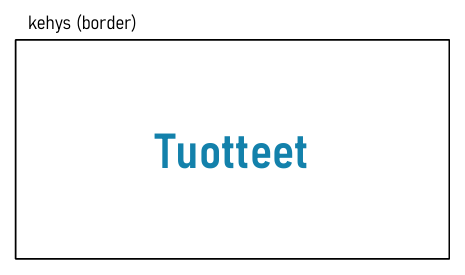
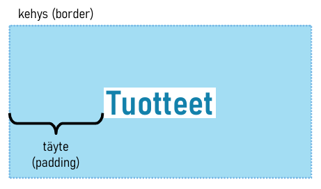
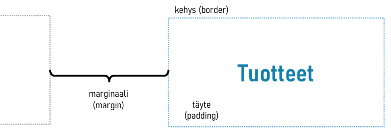

# Laatikkomalli

HTML:ssä kaikki elementit voidaan ajatella jonkilaisina laatikkoina. CSS:n puolella jokainen elementti noudattaa ns. **laatikkomallia** (box model). Laatikkomallissa jokaisella elementillä on sitä ympäröivä *kehys*, kehyksen ulkopuolelle jäävä *marginaali* ja kehyksen sisäpuolelle jäävä *täyte*.

Seuraavissa kohdissa tutustutaan `h2`-elementin laatikkomalliin. HTML-koodissa elementti on esitetty seuraavasti:

```html
<h2>Tuotteet</h2>
```

## Kehys

Jokaisella HTML-elementillä on sitä ympäröivä **kehys** (border), joka on oletuksena näkymätön. Kehyksen paksuus, tyyli ja väri määritellään `border`-määritteellä. Seuraavassa esimerkissä kehysviivan paksuudeksi määritellään yksi pikseli (`1px`), kehysviivan tyyliksi yhteinen viiva (`solid`) ja väriksi musta (`#000000`).

```css
h2 {
  border: 1px solid #000000;
}
```

<div class="image">
 
</div>

CSS mahdollistaa myös kehyksen jokaiselle sivulle yksilölliset määritykset. Esimerkiksi alla olevassa tyylisäännössä määritellään `h2`-elementin kullekin sivulle omat kehysviiva-määritykset. 

```css
h2 {
  border-top: 2px solid #999;
  border-left: 3px solid #333;
  border-right: 3px solid #666;
  border-bottom: 2px solid #000;
}
```

## Täyte 

Sisällön (eli tässä tapauksessa tekstin) ja kehyksen väliin jäävää aluetta kutsutaan **täytteeksi** (padding), joka määritellään `padding`-asetuksella. Seuraavassa esimerkissä asetetaan ylä- ja alareunan täytteeksi `2em`. Vastaavasti vasemman ja oikean reunan täytteeksi asetetaan `3em`.

```css
h2 {
  padding: 2em 3em;
}
```

<div class="image">
 
</div>

Jollain elementeillä on määritelty lähtökohtainen oletustäyte, jonka joutuu tietyissä tilanteissa korvaamaan.

## Marginaali

Kahden vierekkäisen elementin kehysten väliin jäävää aluetta kutsutaan **marginaaliksi** (margin), joka määritellään `margin`-asetuksella. Seuraava esimerkki määrittelee jokaiselle sivulle oman marginaaliarvon. Marginaalien määritys lähtee ylämarginaalista ja etenee siitä myötäpäivään niin, että neljäs arvo määrittelee vasemman reunan marginaalin.

```css
h2 {
  margin: 1em 2em 1em 2em;
}
```

<div class="image">
 
</div>

> Edellä olevan esimerkin voisi esittää tiiviimmin seuraavasti, koska siinä on pareittain samat arvot.
> ```css
> h2 {
>   margin: 1em 2em;   
> }
> ```

Jollain elementeillä on lähtökohtaisesti määriteltynä oletusmarginaali, joka jossain tilanteissa täytyy erikseen poistaa. HTML-sivuja tehdessäsi saatat törmätä seuraavanlaiseen CSS-tyylisääntöön. Se poistaa oletuksena määritellyt täytteet ja marginaalit kaikista elementeistä (`*`-selektori). Tällä tavalla voidaan varmistaa, että sivun sisältö näkyy todennäköisemmin samanlaisena eri laitteilla.

```css
* {
  margin: 0;
  padding: 0;
}