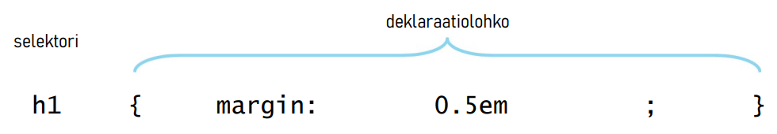
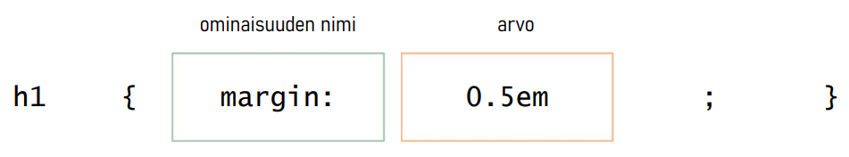
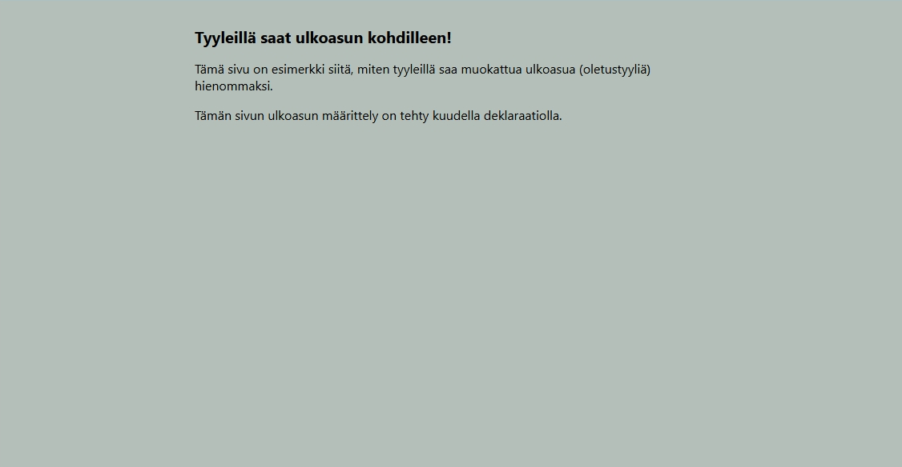

# CSS-tyylit

Aikaisemmin tutustuttiin HTML-merkkaukseen, jolla esitetään dokumentin sisältö. Ohjeena tagien valinnassa oli, että kussakin tilanteessa käytettävä tagi valitaan sisällön perusteella, ei halutun ulkoasun perusteella. Tämän seurauksena HTML-sivu itsessään on vielä aika karun näköinen. 

HTML-sivun ulkoasua voidaan koristella *CSS-tyylien* (Cascading Style Sheets) avulla. Nämä CSS-tyylit esiteltään *tyylisääntöinä* (style rules), jotka kokonaisuutena määrittelevät HTML-sivulle sen ulkoasun. Tyylisäännöt koostuvat yksittäisistä **säännöistä**, jotka määrittelevät tietylle määritellylle kokonaisuudelle ulkoasumääritykset.

## Sääntö

Yksittäinen sääntö muodostuu *selektorista* ja aaltosulkeilla rajatusta 
*deklaraatiolohkosta*. **Selektori** määrää mitä elementtejä sääntö koskee. Selektori voi olla 
yksinkertaisimmillaan elementin nimi (kuten esimerkiksi `h1`). **Deklaraatiolohko** sisältää yhden tai useamman määrittelyn, jotka muokkaavat kohteena olevan elementin ulkoasua. Yksittäistä määrittelyä kutsutaan deklaraatioksi, se päättyy aina puolipisteeseen. 

Alla olevassa esimerkkisäännössä selektorina on `h1`-elementti ja deklaraatiolohkossa on yksi deklaraatio. 

<div class="image">
 
</div>

## Deklaraatio

Deklaraatio koostuu ominaisuuden nimestä ja sen arvosta. **Nimi** määrittelee, mitä tyyliominaisuutta muokataan, **arvo** määrittelee ominaisuudelle uuden arvon. Ominaisuuden nimi ja arvo erotetaan toisistaan aina kaksoispisteellä.

<div class="image">
 
</div><br>

Deklaraatiolohko voi sisältää useamman deklaraation. Deklaraatiot käsitellään 
ylhäältä alas, myöhäisempi määritys korvaa aiemman. 

Esimerkiksi seuraavassa esimerkissä määritellään `p`-elementille marginaali, tekstin koko ja riviväli. Ensimmäisellä rivillä oleva `margin`-määrite asettaa saman levyisen marginaalin elementin jokaiselle sivulle. Toisella rivillä oleva `margin-bottom`-määrite korvaa edellä määritetyn alamarginaalin uudella arvolla. 

```css
p { margin: 1em;
    margin-bottom: 2em; 
    font-size: 80%;
    line-height: 1.4; 
```

> Edellä kuvattu korvaavuus ei todennäköisesti tunnu ihan selkeimmältä, mutta opit niiden toiminnan myöhemmin, kun opit lisää CSS-määritteistä. Lisäksi kannattaa varautua siihen, että tulet oppimaan tästä monesta muusta myös tekemiesi virheiden kautta. 😉

## Tyylisääntöjen liittäminen

Tyylisäännöt voidaan liittää kolmella eri tavalla osaksi HTML-sivua.

1. Tiedostoviittauksella `link`-elementin avulla, jolloin tyylit liitetään omana tiedostona. 
2. Tyylit sijoitetaan HTML-dokumentin `head`-osioon sijoitetun `style`-elementin sisälle. Tällä menetelmällä HTML-dokumentilla on omat, yksilölliset CSS-tyylissäännöt.
3. Yksittäisen HTML-elementin aloitustagiin `style`-määritteenä, jolloin tyyli koskee ainoastaan kyseistä elementtiä.

Näistä ensimmäinen vaihtoehto on suositeltavin, siinä tyylisäännöt liitetään sivustoon erillisenä tiedostona. Tällä tavalla koko sivustolla voidaan käyttää samoja tyylisääntöjä ja koko sivustoa koskevien tyylien muuttaminen on pidemmän päälle nopeampaa.

Tutustutaan seuraavaksi siihen, miten tyylitiedosto liitetään osaksi HTML-sivua.

1. Luo projektikansioon uusi tiedosto, anna sen nimeksi `02-tyylit.html` ja liitä sen sisällöksi seuraava HTML-koodi:

   ```html
   <!DOCTYPE html>
   <html lang="fi">
     <head>
       <meta charset="UTF-8">
       <title>Tyyleillä saat ulkoasun kohdilleen</title>
       <link href="02-tyylit.css" rel="stylesheet">
     </head>
     <body>
       <h1>Tyyleillä saat ulkoasun kohdilleen!</h1>
       <p>Tämä sivu on esimerkki siitä, miten tyyleillä saa muokattua ulkoasua (oletustyyliä) hienommaksi.</p>
       <p>Tämän sivun ulkoasun määrittely on tehty kuudella deklaraatiolla.</p>
     </body>
   </html>
   ```

   Tämä dokumentti on rakenteeltaan identtinen aikasempien esimerkkien kanssa. Keskeinen lisäys on `head`-elementissä oleva `link`-elementti, jolla CSS-tiedosto saadaan kytkettyä osaksi HTML-sivua. Tässä HTML-dokumenttiin linkitetään `02-css.css`-niminen tiedosto.

2. Luo projektikansioon uusi tiedosto, anna sen nimeksi `02-tyylit.css` ja liitä sen sisällöksi seuraavat CSS-tyylisäännöt:

   ```css
   body {
     font-family: system-ui, sans-serif;
     background-color: #B3BFB8;
     color: #000;
     max-width: 40em;
     margin: 2em auto;
   }

   h1 {
     font-size: 1.25em;
   }
   ```

3. Avaa **HTML-sivu** selaimessa samalla tavalla, mitä edellisellä sivulla ohjeistettiin.

   <div class="image">
     
   </div><br>

## Tyylisäännöt avattuna

Seuraavaksi tutustutaan hieman siihen, mitä edellä olevat tyylisäännöt määrittelevät.

```css
body {
  font-family: system-ui, sans-serif;
  background-color: #B3BFB8;
  color: #000;
  max-width: 40em;
  margin: 2em auto;
}
```

Alussa oleva `body`-selektori kohdistaa deklaraatiolohkossa olevat määrittelyt vaikuttamaan dokumentin `body`-elementtiin. Siihen määritellään tyypillisesti koko dokumenttia koskevat tyylimääritykset, kuten käytettävä fontti, taustaväri ja tekstinväri. 
 
`font-family`-asetuksella määritellään elementissä (ja tässä tapauksessa koko dokumentissa) käytettävä fontti. `system-ui` ja `sans-serif` ovat geneerisiä tunnisteita, eivät siis oikeita fonttien nimiä. Käytettävät fontit listataan pilkulla erotettuna, joista ensimmäiseksi laitteelta löytyvää fonttia käytetään ensisijaisesti. 

Esimerkissä ensisijaisesti käytetään ns. `system-ui`-fonttia, joka on laitteen käyttöliittymässä käytössä oleva oletusfontti. Toissijaisesti käytetään mitä tahansa `sans-serif`-perheen fonttia, jolloin käytetään päätteetöntä fonttia, joka laitteessa oletuksena käytetään. Tämän seurauksena Windows-koneissa käytetään todennäköisesti Segoe UI -fonttia ja Mac OS -koneissa puolestaan San Francisco -fonttia. 

> Osa CSS-tyylimäärityksistä ovat sellaisia, jotka periytyvät (inherit) lapsielementeille, jolloin niitä ei tarvitse määritellä jokaiselle alaelementille erikseen. Esimerkiksi edellä käsitelty `font-family` on sellainen. Kun käytettävä fontti määritellään `body`-elementille, niin silloin samaa fonttia käytetään kauttaaltaan koko dokumentissa, jollei sitä erikseen määritellä toiseksi.
>
> W3Schoolin sivuilla on tiivis esittely [font-family](https://www.w3schools.com/cssref/pr_font_font-family.php)-määritteestä. Sivun taulukossa oleva `Inherited: yes`-rivi kertoo, että kyseinen määrite periytyy.

`background-color` asettaa elementille sen taustavärin. Esimerkissä värikoodi annetaan ns. HTML-värikoodina, missä arvo alkaa `#`-merkillä ja sen perässä on joko kolme tai kuusi numeroa. Tässä tapauksessa taustaväriksi määritellään vaaleanvihreä. Taustaväri ei periydy sen lapsielementeille. Elementtien taustaväri on oletuksena läpinäkyvä, jolloin koko sivun taustaväri on automaattisesti muidenkin sivulla olevien elementtien taustaväri.

> HTML-värikoodi on oikeasti numeroita, vaikka siellä näyttää esiintyvän kirjaimia joukossa. Värikoodi esitetään kompaktimmassa heksadesimamaalimuodossa, jossa käytössä olevat numerot ovat `0`, `1`, `2`, `3`, `4`, `5`, `6`, `7`, `8`, `9`, `A`, `B`, `C`, `D`, `E` ja `F`.

`color` määrittelee käytettävän tekstivärin, joka esimerkkitapauksessa asetetaan mustaksi. Tekstivärin määritys periytyy lapsielementeille eli esimerkissä koko dokumentin tekstiväri on musta, jollei sitä erikseen määritetä jollekin elementille toiseksi. Poikkeuksena ovat linkit, joiden oletusvärit eivät muutu, ne täytyy asettaa erikseen.

> Suositeltava käytäntö on, että `background-color` että `color` määritellään aina yhdessä. Tällöin järjestelmän poikkeavat oletusvärit eivät sekoita tarkkaan mietittyä ulkoasua.

> Netistä löytyy paljon erilaisia palveluita, joilla pystyy luomaan helpolla toisiinsa sopivia väriyhdistelmiä. Esimerkiksi [Coolors](https://coolors.co) on yksi hyvin helppokäyttöinen väriyhdistelmien luontiin soveltuva palvelu. 

`max-width`-asetuksella määritellään sivun suurin sallittu leveys eli sen alueen leveys, jossa sivun sisältö on. Arvoksi määritellään `40em`, joka tarkoittaa 40 kirjaimen korkeutta. 

> `em`-yksikkö on ns. suhteellinen yksikkö eli se saa arvonsa käytössä olevaan fonttikokoon perustuen. Tämä yksikkö mahdollistaa skaalautuvien sivujen toteuttamisen, jossa sivun ulkoasua ei ole sidottu tiettyyn esimääriteltyyn arvoon.

`margin`-asetuksella määritellään koko dokumentin ympärillä olevat marginaalialueet. `2em` määrittelee sivun ylä- ja alareunaan kahden kirjaimen korkuisen tyhjän alueen. `auto` puolestaan keskittää sisällön vaakasuunnassa keskelle niin, että sekä vasemmassa että oikeassa reunassa on saman kokoinen tyhjä alue.

```css
h1 {
  font-size: 1.25em;
}
```

Tämä tyylisääntö kohdistuu pelkästään sivulla oleviin `h1`-elementteihin. `font-size`-asettaa niiden fonttikooksi 1,25 kertaa tavallista tekstikokoa isomman koon. Vaihtoehtoisesti tässä voisi käyttää myös arvoa `125%`.

Nyt sinulla on pieni käsitys siitä, mitä CSS-tyylit ovat ja mitä niillä voi saada aikaan.