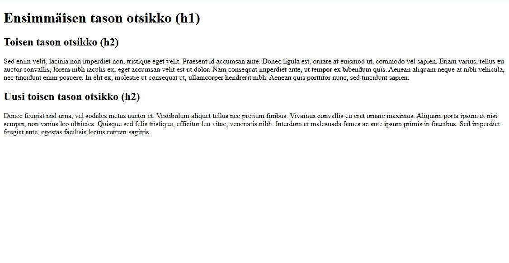
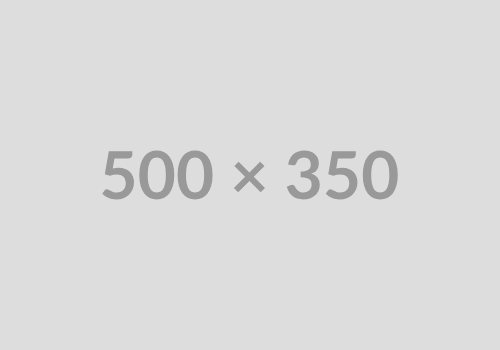
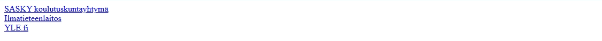
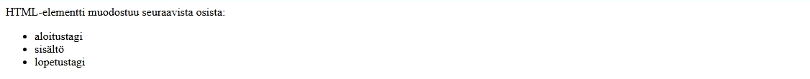
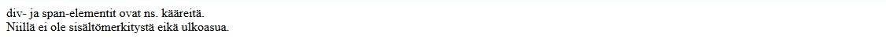

# Yleisimmät HTML-elementit
 
Alla olevassa taulukossa on HTML-kielen yleisimmin käytetyt elementit. Näiden elementtien avulla saa toteutettua täysin toimivan HTML-sivun.
 
| elementti           | merkitys        |
|---------------------|-----------------|
| `h1`, &hellip; `h6` | otsikko         |
| `p`                 | tekstikappale   |
| `img`               | kuva            |
| `ul`                | (pallukka)lista |
| `li`                | lista-alkio     |
| `div`ja `span`      | kääre-elementit |
 
Tutustutaan seuraavaksi näiden elementtien käyttöön esimerkkien avulla.
 
## Otsikko (`h1`, &hellip; `h6`)
 
Otsikkotason elementeillä merkitään dokumentin otsikot. Sivun pääotsikko merkitään `h1`-elementillä, sen alaotsikot `h2`-elementeillä ja niin edelleen.
 
```html
<h1>Tämä on sivun pääotsikko</h1>
```
 
Otsikkoelementit näkyvät tyypillisesti lihavoituna ja isommalla tekstikoolla. Niiden ulkoasu muokataan halutunlaiseksi CSS-tyyleillä.
 
<div class="image">
 
</div>
 
> Muistisääntö: `h1`, &hellip; `h6`-elementtien nimet ovat lyhenne sanasta *header*.
 
## Tekstikappale (`p`)
 
Tavallinen tekstikappale merkitään `p`-elementillä.
 
```html
<p>Suspendisse solades risus nibh, eu pretium…</p>
```
 
Tekstikappale näkyy tyypillisesti normaalilla tekstikoolla. Sen ylä- ja alapuolella on pieni väli erottamassa sitä muusta sisällöistä.
 
<div class="image">
 
</div>
 
> Muistisääntö: `p`-elementin nimi on lyhenne sanasta *paragraph*.
 
## Kuva (`img`)
 
Kuva merkitään `img`-elementillä. `img` on tyhjä elementti (eli sillä ei ole sisältöä eikä lopetustagia). Kuvan osoite määritellään `src`-määritteellä ja kuvan vaihtoehtoinen teksti `alt`-määritteellä.
 
```html

```
 
Kuva näkyy tyypillisesti sen luonnollisessa koossa, kuvan kokoa muokataan CSS-tyyleillä.
 
<div class="image">
 
</div>
 
> Muistisääntö: `img`-elementin nimi on lyhenne sanasta *image*.
 
## Linkki (`a`)
 
Linkki toiselle sivulle tai saman sivun toiseen kohtaan merkitään `a`-elementillä.Linkin osoite määritellään `href`-määritteellä ja elementin sisällöksi tulee linkkiteksti.
 
```html
<a href="https://sasky.fi">SASKY koulutuskuntayhtymä</a>
```
 
Linkki näkyy tyypillisesti alleviivattuna tekstinä. Linkin väri on sininen (linkkiä ei ole vielä avattu) tai violetti (linkki on avattu).
 
<div class="image">
 
</div>
 
> Muistisääntö: `a`-elementin nimi on lyhenne sanasta *anchor*.
 
## Lista (`ul` ja `li`)
 
Lista merkataan `ul`-elementillä, sen sisällöksi tulee kukin kohta omana `li`-elementtinään.
 
```html
<ul>
  <li>aloitustagi</li>
  <li>sisältö</li>
  <li>lopetustagi</li>
</ul>
```
 
Listan alkioiden alussa on tyypillisesti pallukka, siksi tätä listaa kutsutaan yleisesti pallukkalistaksi, vaikka sen
virallinen nimi on *järjestämätön lista*.
 
<div class="image">
 
</div>
 
Listan ulkoasua  muokataan CSS-tyylien avulla. Sivujen navigointilinkit toteutetaan usein tällä elementtirakenteella.
 
> Muistisääntö: `ul`-elementin nimi on lyhenne sanoista *unordered list* ja `li`-elementin nimi on lyhenne sanoista *list item*.
>
> Listasta on olemassa variantti, jossa alkiot on numeroitu. Tätä kutsutaan järjestetyksi listaksi eli *ordered list*. Se merkataan `ol`-elementillä ihan samalla tavalla kuin `ul`-lista.
 
## Lohko- ja sisätason elementit
 
Suurin osa HTML-kielen elementeistä kuuluvat joko lohkotason tai sisätason elementteihin. Niiden oleellinen ero on siinä, miten ne käyttäytyvät sivulle tulostettaessa.
 
**Lohkotason elementit** (*block-level element*) alkavat aina uuden rivin alusta ja niiden jälkeen tulee rivinvaihto eli niiden perään ei tule enää muuta sisältöä. Esimerkiksi otsikot (`h1`, &hellip; `h6`), tekstikappale (`p`) ja lista (`ul`) ovat lohkotason elementtejä.
 
**Sisätason elementit** (*inline element*) puolestaan eivät ala automaattisesti uuden rivin alusta ja ne eivät päätä riviä. Toisin sanoen ne voivat sijaita keskellä tekstiä. Sisätason elementtejä ovat muun muassa linkki (`a`) ja kuva (`img`)
 
## Kääreet (`div` ja `span`)
 
`div`- ja `span`-elementit eroavat muista edellä esitellyistä elementeistä. Niillä ei ole sisältömerkitystä eikä myöskään ulkoasumerkitystä. Ne ovat toisin sanoen
eräänlaisia ”näkymättömiä” kehyksiä eli kääreitä.
 
```html
<div>
  div ja <span>span</span> ovat kääreitä.
</div>
```
 
<div class="image">
 
</div>
 
Niitä käytetään silloin, kun halutaan määritellä ulkoasutyylejä isommalle kokonaisuudelle, jolle ei ole olemassa omaa loogista elementtiä.
 
`div` on lohkotason elementti ja `span` on  sisätason elementti.
 
## Minkä elementin valitsen?
 
Valitse elementti aluksi edellä olevista sen perusteella, mikä on sen lähin sisältömerkitys. Kun nämä ovat tulleet tutuiksi, niin voit ottaa [htmlreference.io](https://htmlreference.io/)-sivustolta esiteltyjä elementtejä mukaan käyttämiisi elementteihin.
