# Ensimmäinen HTML-sivu

Nyt HTML-kielen käsitteet ja peruselementit ovat tuttuja. Seuraavaksi kääritään hihat ja luodaan ihan ensimmäinen HTML-sivu ja katsotaan, miltä se näyttää selaimessa.

## Projektikansion luominen

Kaikki tässä materiaalissa tehtävät tiedostot kannattaa tallentaa samaan sijaintiin, jotta niiden löytäminen on myöhemmin helpompaa. Sitä varten luomme ensin tätä materiaalia varten oman "projektikansion", jota tulemme käyttämään jatkossa.

Tässä ohjeessa neuvotaan, miten projektikansio luodaan Windows-käyttöjärjestelmällä. Jos sinulla on jokin toinen käyttöjärjestelmä käytössä, niin sovella ohjeita. Perusperiaate on sama kaikissa käyttöjärjestelmissä.

1. Käynnistä Windowsin *Resurssienhallinta* klikkaamalla sen kuvaketta alareunan tehtäväpalkista.
   
   <div class="image">
     
   </div>

2. Valitse vasemman reunan siirtymisruudusta **Tiedostot**-vaihtoehto (Documents).

   <div class="image">
     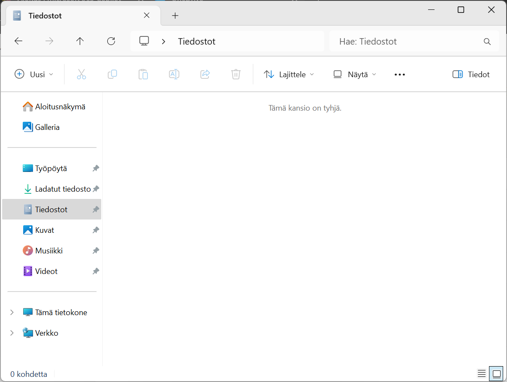
   </div>

3. Valitse yläreunan valikosta **Uusi** ja sen alta avautuvasta valikosta **Kansio**.

   <div class="image">
     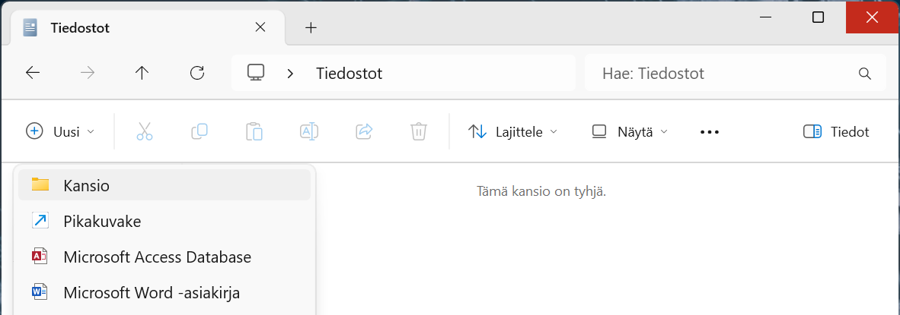
   </div>

4. Anna uuden kansio nimeksi `koodaajasivut`.

   <div class="image">
     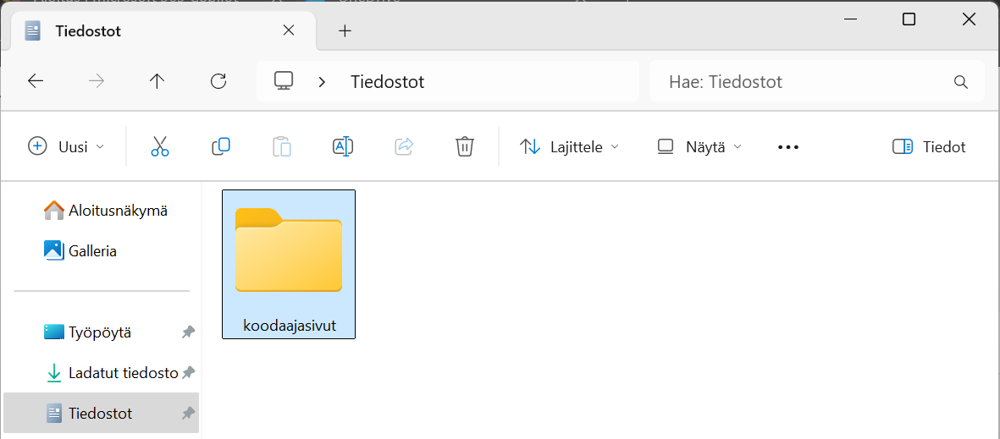
   </div>

Nyt sinulla on uusi projektikansio luotuna omalle koneellesi, tätä kansiota käytämme jatkossa uusien tiedostojen tallennuspaikkana.

> Voit halutessasi jatkossa sijoittaa  tiedostot omaan, itse määrittelemääsi kansioon. Myöhemmissä vaiheissa tehtävät tiedostot toimivat samalla tavalla, sijaitsevat ne missä tahansa. Muista kuitenkin soveltaa ohjeistusta aina silloin, kun ohjeistuksessa tallennetaan tai avataan tiedostoa.

## Projektikansion avaaminen Visual Studio Codessa

Seuraavaksi avaamme edellä luomamme projektikansion Visual Studio Codessa. Seuraavat ohjeet toimivat sellaisenaan, vaikka olisit asennuksen jälkeen tutustunut *Get Started with VS Code* -tutoriaaliin.

1. Avaa Visual Studio Code.

2. Valitse **File**-valikon alta **Open Folder&hellip;**.

   <div class="image">
     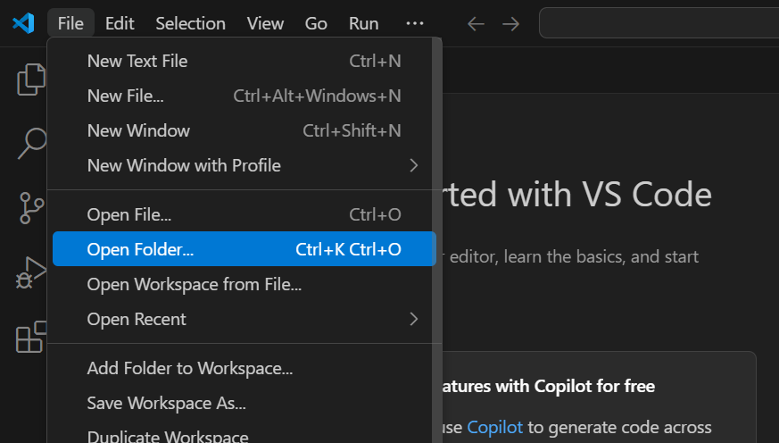
   </div>

3. Valitse avautuvan ikkunan vasemmasta reunasta ensin **Tiedostot** ja valitse tämän jälkeen **koodaajasivut**-kansio. 

   > Jos loit kansion eri nimellä tai eri paikkaan, niin etsi ja valitse se tässä kohdassa.

   Hyväksy valintasi painamalla **Valitse kansio** -nappia.

   <div class="image">
     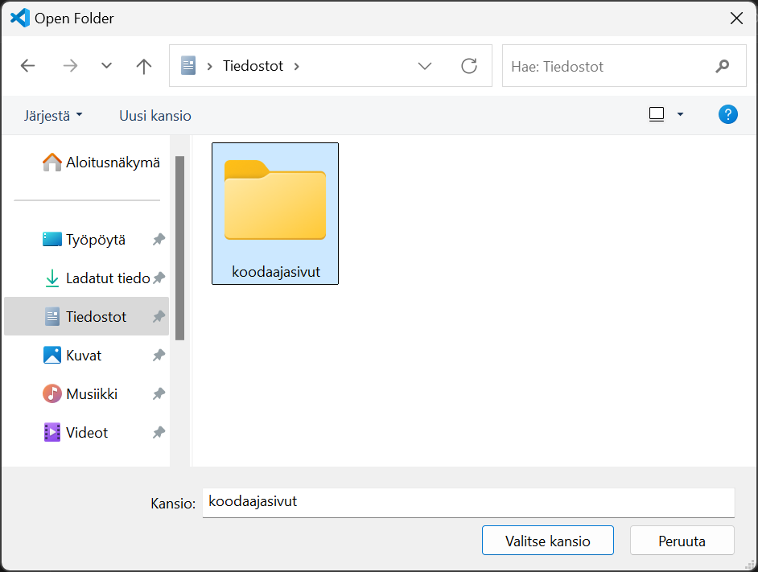
   </div>

4. Visual Studio Code varmistaa vielä, että luotatko kansiossa olevien tiedostojen tekijöihin. Koska tämä kansio tulee sisältämään sinun itsesi tekemiä tiedostoja, niin voit turvallisesti valita **Yes, I trust the authors** -vaihtoehdon.

   <div class="image">
     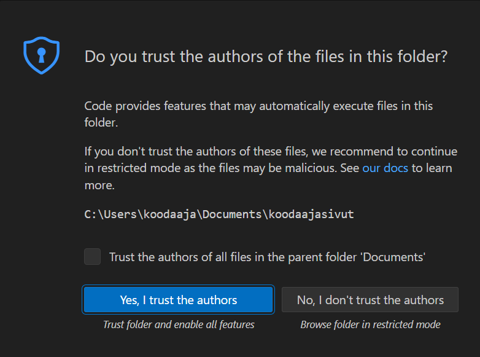
   </div>

5. Projektikansio on nyt avattu Visual Studio Codessa ja sinne voi nyt alkaa luomaan omia tiedostoja.

   <div class="image">
     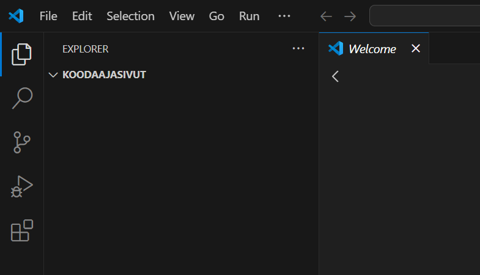
   </div>

## HTML-sivun luominen

Seuraavaksi luomme projektikansioon uuden HTML-sivun. 

1. Kopioi seuraava ohjelmakoodi leikepöydälle. 

   > Vinkki: Voit kopioida koko tekstin klikkaamalla koodialueen oikeassa yläkulmassa olevaa kopioitikuvaketta.
  
   ```
   <!DOCTYPE html>
   <html lang="fi">
     <head>
       <meta charset="UTF-8">
       <title>Hei koodausmaailma!</title>
     </head>
     <body>
       <h1>Hei koodausmaailma!</h1>
       <p>Tämä sivu on ensimmäinen askel kohti koodaamisen ihmeellistä maailmaa.</p>
     </body>
   </html>
   ```

2. Klikkaa KOODAAJASIVUT-tekstin vieressä olevaa **New File&hellip;**-kuvaketta.

   <div class="image">
     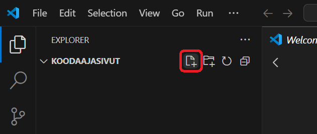
   </div><br>

3. Syötä uuden tiedoston nimeksi `01-hello.html` ja paina *Enter*-näppäintä.

   <div class="image">
     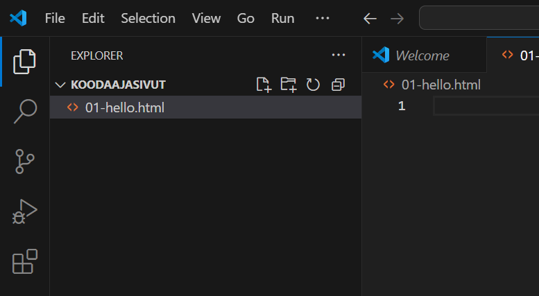
   </div><br>

   > Tämän materiaalin tiedostonimet alkavat numeroilla, jolloin niiden löytäminen jatkossa on helpompaa.  

4. Liitä leikepöydälle kopioimasi HTML-koodi editorinäkymään.

   <div class="image">
     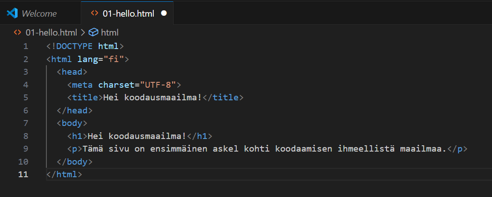
   </div><br>

   Tiedostonimen perässä on täytetty ympyrä. Se ilmoittaa, että tiedostoa on muokattu edellisen tallennuksen jälkeen.

   > Tässä vaiheessa kannattaa myös tarkistaa, että VS Coden alapalkissa näkyy, että merkistökoodauksena (encoding) käytetään *UTF-8*-muotoa.

4. Tallenna tiedosto valitsemalla **File**-valikosta kohta **Save**. 

   Nyt tiedosto on tallennettu levylle. Tämän voi tarkistaa välilehden otsikosta. Tiedostonimen perässä on X-kuvake. Tämä ilmoittaa, että tiedostoon ei ole tehty viimeisimmän tallennuksen jälkeen.

## HTML-sivun avaaminen selaimessa

Seuraavaksi voidaan katsoa, miltä sivu näyttää selaimessa.

1. Käynnistä Windowsin *Resurssienhallinta* klikkaamalla sen kuvaketta alareunan tehtäväpalkista.
   
   <div class="image">
     
   </div>

2. Valitse vasemman reunan siirtymisruudusta **Tiedostot**-vaihtoehto (Documents).

   <div class="image">
     
   </div><br>

3. Avaa **koodaajasivut**-kansio tuplaklikkaamalla sen kuvaketta.

   <div class="image">
     
   </div><br>

4. Tuplaklikkaa kansiosta löytyvää **01-hello.html**-tiedostoa.

   <div class="image">
     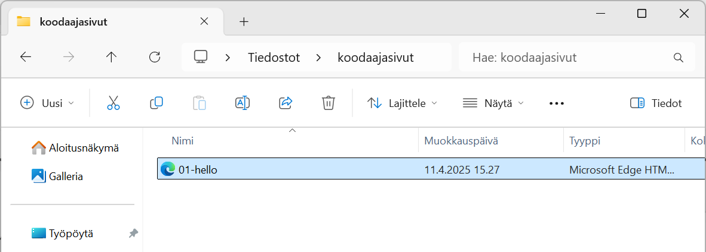
   </div><br>

5. HTML-sivu on nyt selaimessa auki.

   <div class="image">
     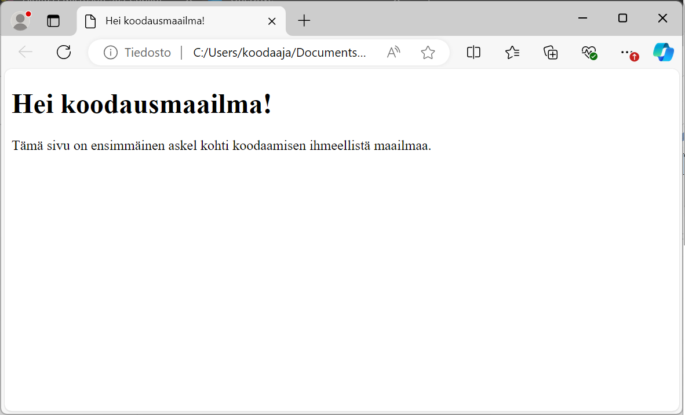
   </div><br>

6. Kokeile muuttaa HTML-sivua seuraavasti:

   - Muuta HTML-tiedostoa Visual Studio Codessa. Muutos voi olla esimerkiksi p-elementissä olevan tekstin muuttaminen toisenlaiseksi. 
   - Tallenna tekemäsi muutokset. Tarkista, että tiedostonimen perässä oleva ympyrä muuttuu X-kuvakkeeksi.
   - Päivitä selainsivu painamalla F5-näppäintä tai painamalla osoiterivin vasemmalla puolella olevaa päivityskuvaketta.

Nyt osaat luoda projektikansioon uusia tiedostoja ja tiedät, miten pääset katsomaan niitä selaimessa.