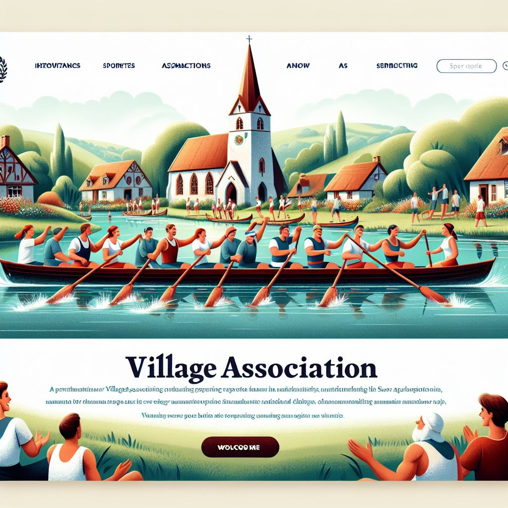
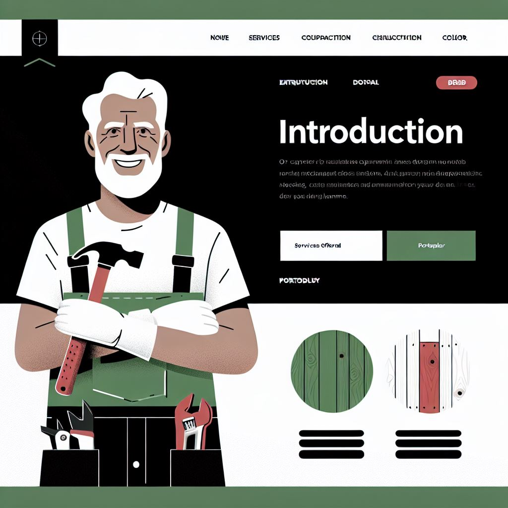
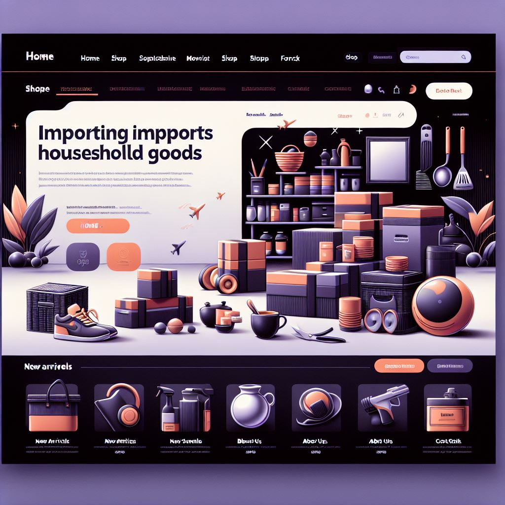
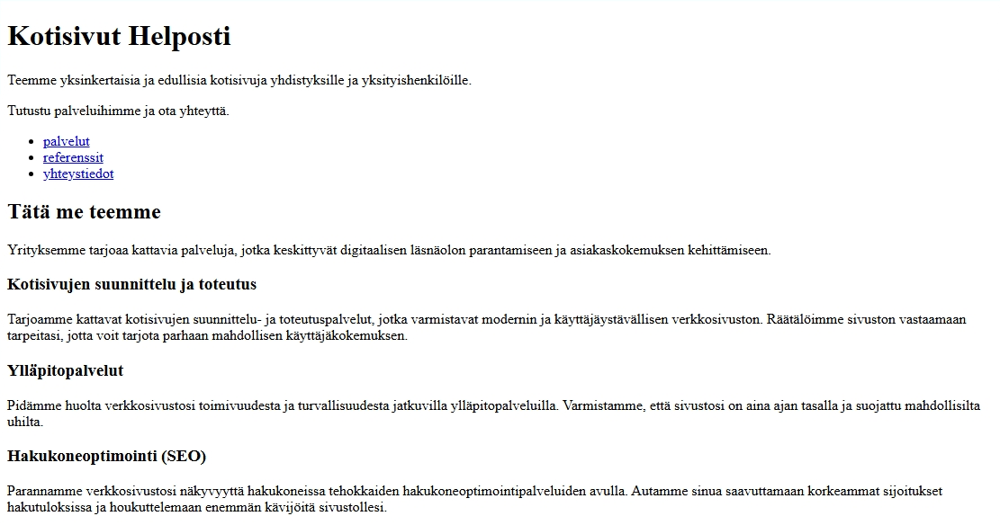

# Yhden sivun kotisivupohja

Seuraavaksi toteutamme yksinkertaiset yhden sivun kotisivut (one page website). Siinä kaikki sisältö sijaitsee yhdellä sivulla, jossa sisältöjen välillä liikutaan skrollaamalla sivua ylös- ja alaspäin. Tämän tyyppiset sivut toimivat loistavasti silloin, kun sisältöä on maltillisesti, kuten esimerkiksi profiilisivulla, CV:ssä tai tapahtumasivustolla.

## HTML-sivupohja

Ensin luomme HTML-sivupohjan. Luo projektikansioon uusi tiedosto, anna sen nimeksi `03-onepage.html` ja liitä  sisällöksi seuraava HTML-koodi.

```html
<!DOCTYPE html>
<html lang="fi">
  <head>
    <meta charset="UTF-8">
    <meta name="viewport" content="width=device-width, initial-scale=1.0">
    <title>Kotisivut Helposti - räätälöityjä kotisivuja joka lähtöön</title>
    <link href="03-onepage.css" rel="stylesheet">
  </head>
  <body>
    
    TODO etusivu

    TODO palvelut

    TODO referenssit

    TODO yhteystiedot

    TODO alaotsake
    
  </body>
</html>
```

Kuten varmasti arvasit, niin tämä sivu ei näytä vielä juuri miltään. Sivupohja itsessään on ihan samanlainen, mitä aiemmin. Uutena lisäksenä oli `meta viewport` -määritys, joka varmistaa, että sivusto näyttää fiksulta myös mobiililaitteilla. Tästä löytyy lisätietoa w3School-sivuston  [Responsive Web Design - The Viewport](https://www.w3schools.com/css/css_rwd_viewport.asp) -sivulta.


## Yksittäiset sivut

Seuraavissa kohdissä lisätään `TODO`-rivien paikalle yksi kerrallaan sivun sisältöä.

1. Korvaa `TODO etusivu` -rivi seuraavalla HTML-koodilla:
 
   ```html
       <header>
         <div>
           <h1>Kotisivut Helposti</h1>
           <p>Teemme yksinkertaisia ja edullisia kotisivuja yhdistyksille 
              ja yksityishenkilöille.</p>
           <p>Tutustu palveluihimme ja ota yhteyttä.</p>
           <nav>
             <ul>
               <li><a href="#palvelut">palvelut</a></li>
               <li><a href="#referenssit">referenssit</a></li>
               <li><a href="#yhteystiedot">yhteystiedot</a></li>
             </ul>
           </nav>
         </div>
       </header>
   ```

   Tässä HTML-koodissa on aikaisempaan nähden kaksi uutta elementtiä: `header` ja `nav`. Ne ovat ns. semanttisia elementtejä eli ne määrittelevät sisällön merkityksen suhteessa koko sivuun. `header`-elementillä määritellään sivun yläotsake. Tässä esimerkissä `header`-elementti sisältää sen sisällön, mitä sijoitettaisiin sivuston etusivulle. `nav`-elementti sisältää ne linkit, joilla navigoidaan (eli liikutaan) sivun sisällä.

   Navigointilinkkien osoitteiden alussa on `#`-merkki, jolla tehdään linkki sivun sisällä toiseen kohtaan. Tämä merkintätapa avautuu seuraavassa kohdassa paremmin, kun määrittelemme elementille tunnisteen.

2. Korvaa `TODO palvelut` -rivi seuraavalla HTML-koodilla:

   ```html
       <section id="palvelut">
         <h2>Tätä me teemme</h2>
         <p>Yrityksemme tarjoaa kattavia palveluja, jotka keskittyvät 
            digitaalisen läsnäolon parantamiseen ja asiakaskokemuksen 
            kehittämiseen.</p>
         <div class="palvelut">
           <div>
             <h3>Kotisivujen suunnittelu ja toteutus</h3>
             <p>Tarjoamme kattavat kotisivujen suunnittelu- ja toteutuspalvelut, 
                jotka varmistavat modernin ja käyttäjäystävällisen verkkosivuston. 
                Räätälöimme sivuston vastaamaan tarpeitasi, jotta voit tarjota 
                parhaan mahdollisen käyttäjäkokemuksen.</p>  
           </div>
           <div>
             <h3>Ylläpitopalvelut</h3>
             <p>Pidämme huolta verkkosivustosi toimivuudesta ja turvallisuudesta 
                jatkuvilla ylläpitopalveluilla. Varmistamme, että sivustosi on aina 
                ajan tasalla ja suojattu mahdollisilta uhilta.</p>
           </div>
           <div>
             <h3>Hakukoneoptimointi (SEO)</h3>
             <p>Parannamme verkkosivustosi näkyvyyttä hakukoneissa tehokkaiden 
                hakukoneoptimointipalveluiden avulla. Autamme sinua saavuttamaan 
                korkeammat sijoitukset hakutuloksissa ja houkuttelemaan enemmän 
                kävijöitä sivustollesi.</p>
           </div>
           <div>
             <h3>Sisällöntuotanto</h3>
             <p>Luomme laadukasta ja kiinnostavaa sisältöä, joka puhuttelee 
                kohdeyleisöäsi ja tukee yrityksesi viestintää. 
                Sisällöntuotantopalvelumme kattavat kaiken blogikirjoituksista 
                ja artikkeleista aina markkinointimateriaaleihin.</p>
           </div>
           <div>
             <h3>Kotisivujen päivitys ja muokkaus</h3>
             <p>Tarjoamme joustavia päivitys- ja muokkauspalveluita, joiden 
                avulla voit pitää verkkosivustosi ajan tasalla ja vastaamaan 
                muuttuvia tarpeita. Päivitämme sisältöä, ulkoasua ja 
                toiminnallisuuksia tarpeidesi mukaan.</p>  
           </div>
         </div>
       </section>
   ```

   Tässä kokonaisuuden merkkaus on myöskin pääosin tuttua entuudestaan. Koko sisältö on kääritty `section`-elementin sisälle, joka sekin on semanttinen elementti. Sillä voidaan merkitä yksittäinen kokonaisuus, tässä tapauksessa tapauksessa `section`-elementti sisältää *Palvelut*-alasivun sisällön.

   `section`-elementille on annettu `id`-määritteellä tunniste. **Tunniste** määrittelee elementille yksilöllisen nimen, jolla siihen voidaan viitate muissa yhteyksissä. Mille tahansa HTML-elementille voi määritellä tunnisteen, kunhan se on HTML-sivun sisällä täysin yksilöllinen.

   Etusivun navigoinnissa *palvelut*-osion osoitteena on `#palvelut`. Kun käyttäjä klikkaa tätä linkkiä, niin selain siirtyy sivun sisällä siihen kohtaan, josta tuo `#`-merkin perässä oleva tunniste on. Eli tässä tapauksessa selain siirtyy edellä lisätyn `section`-elementin alkuun.

   `div`-elementille määritelty `class`-määrite määrittelee ko. elementille luokkanimen. Luokkanimet ovat käteviä, kun halutaan kohdistaa ko. elementille juuri tietyt tyylimääritteet. Tästä näet esimerkin myöhemmin, kun lisäämme tälle HTML-sivulle tyylimääritteet. Toisin kuin tunnisteita, niin samaa luokkanimeä voi käyttää HTML-sivulla useamman kerran.

   > Huomaa, että HTML-sivulla voi olla saman niminen tunniste (`id`) ja luokka (`class`), ne eivät riitele keskenään. Näiden kanssa on silti hyvä olla tarkkana. Saatat nimittäin törmätä tilanteeseen, kun ihmettelet CSS-tyylimäärityksesi toimimattomuutta ja huomaat lopulta, että olet vahingossa tyylisäännöt luokan sijasta tunnisteelle.

3. Korvaa `TODO referenssit` -rivi seuraavalla HTML-koodilla:

   ```html
       <section id="referenssit">
         <h2>Referenssejä</h2>
         <p>Tässä muutamia esimerkkejä toteuttamistamme kotisivuista.</p>
         <div class="referenssit">
           <div>
             <h3>Kylän Kunto</h3>
             
             <p>Tämä kesäinen kotisivu on suunniteltu kylän urheilutoimintaa 
                edistävälle yhdistykselle. Yhdistys ylläpitää talvella hiihtolatuja 
                ja kesällä tarjoaa mahdollisuuden soutaa kirkkoveneellä. 
                Sivustolla esitellään yhdistyksen tarjoamat aktiviteetit ja 
                palvelut, sekä annetaan tietoa tapahtumista ja yhteystiedoista.</p>
           </div>
           <div>
             <h3>Puuseppä Hirvonen</h3>
             
             <p>Tämä yksinkertainen ja tyylikäs kotisivu on suunniteltu puusepälle, 
                joka tarjoaa laadukkaita ja kestäviä puutöitä. Sivustolla esitellään 
                puusepän palvelut, kuten huonekalujen valmistus, korjauspalvelut, 
                mittatilaustyöt ja sisustussuunnittelu. Yhteystiedot-osio 
                mahdollistaa helpon yhteydenoton. Sivuston värimaailma koostuu 
                mustasta, valkoisesta, vihreästä ja punaisesta, mikä luo raikkaan ja 
                ammattimaisen ilmeen.</p>
           </div>
           <div>
             <h3>Taloustuonti Oy</h3>
             
             <p>Tämä kotisivu on suunniteltu taloustavaroiden maahantuontia 
                harjoittavalle yritykselle. Sivustolla esitellään yrityksen tarjoamat 
                palvelut, kuten tuotteiden maahantuonti, varastointi ja logistiikka, 
                jakelu ja myynti sekä asiakaspalvelu ja tuki.</p>
           </div>
         </div>
       </section>
   ```

   Tämä on rakenteeltaan hyvin samankaltainen, kuin edellinen osio. Tässä osiossa hyödynnetään kolmea valmista kuvaa. Lataa ja tallenna ne samaan kansioon HTML-tiedoston kanssa.

    - Tallenna [tämä kuva](03-kunto.jpg) nimellä `03-kunto.jpg`.
    - Tallenna [tämä kuva](03-puuseppa.jpg) nimellä `03-puuseppa.jpg`.
    - Tallenna [tämä kuva](03-tuonti.jpg) nimellä `03-tuonti.jpg`.

   > Vinkki: Voit tallentaa kuvat klikkaamalla linkin päällä hiiren kakkospainikkeella ja valitsemalla ponnahdusvalikosta kohta **Tallenna linkki nimellä**. Valitse kuvan tallennuspaikaksi projektikansio.

4. Korvaa `TODO yhteystiedot` -rivi seuraavalla HTML-koodilla:

   ```html
       <section id="yhteystiedot">
         <h2>Kiinnostuitko?</h2>
         <p>Yrityksemme toimitilat ovat Tampereella. Olet lämpimästi tervetullut 
            toimistollemme keskustelemaan siitä, miten voisimme sinua auttaa.</p>
         <address>
           Kuninkaanakatu 24<br>
           33200 Tampere<br>
           <br>
           &#9742; <a href="tel:+358400112233">0400 112233</a>
         </address>
       </section>
   ```

   Tässä osiossa `address`-elementti on uusi. Sillä merkitään sivulla olevat osoitetiedot. Huomaa myös linkin erikoinen osoite. Tällä tavalla puhelinnumero avautuu älypuhelimissa suoraan puhelinsovellukseen, kun sitä napautetaan sivulla.

   `br`-elementit tekevät pakotetun rivivaihdon. Sitä voi käyttää mm. `address`-elementissä tekstin rivitykseen. Muistisääntönä `br` tulee sanasta **break**.

5. Korvaa `TODO alaotsake` -rivi seuraavalla HTML-koodilla:

   ```html
       <footer>
         <p>&copy; 2025 Kotisivut Helposti</p>
         <p>Etusivun taustakuva unsplash.com, muun sisällön on luonut Copilot-tekoäly.</p>
       </footer>
   ```

   Tämä määrittelee `footer`-elementin, joka on myös semanttinen elementti. Sitä käytetään merkaamaan sivun alaotsake. Se sisältää yleensä ns. copyright-tiedot sekä mahdolliset rekisteriselosteet.

Näiden jälkeen sivun HTML-osuus on valmis. Se ei näytä tällä hetkellä kovin ihmeelliseltä, koska siihen ei ole vielä kytketty tyylisääntöjä. Kun sivu avataan selaimessa, niin se näyttää seuraavanlaiselta:

<div class="image">
  <a href="onepage-1-full.png"></a>
</div><br>

> Vihje: Kuvaa klikkaamalla saat näkyville koko sivun kuvaruutukopion.

Seuraavaksi lähdemme määrittämään sivun ulkoasua.