# Kotisivupohjan ulkoasu

Edellisessä vaiheessa koostettiin osa osalta yhden sivun kotisivut pienelle kotisivuja tekevälle yritykselle. Seuraavaksi määritellään tälle kotisivulle pala palalta ulkoasu.

Luo projektikansioon uusi tiedosto, anna sen nimeksi `03-onepage.css` ja liitä sen sisällöksi seuraavissa kohdissa olevat CSS-tyylimääritykset.

1. Aivan ensimmäiseksi tuodaan [Google Fonts](https://fonts.google.com/) -palvelusta sivustolla käytettävä [Inter](https://fonts.google.com/specimen/Inter)-fontti. Tämä tapahtuu seuraavalla tuontilauseella, kopioi ja liitä se CSS-tiedoston alkuun. 

   ```css
   @import url('https://fonts.googleapis.com/css2?family=Inter:ital,opsz,wght@0,14..32,100..900;1,14..32,100..900&display=swap');
   ```

2. Seuraavaksi määritellään sivustolla käytettävät värit ja pari arvoa. Tässä hyödynnetään CSS:n muuttujia, joiden avulla arvot määritellään vain kerran ja tämän jälkeen käytetään niille annettuja nimiä.  Kopio ja liitä seuraava teksti edellisen `import`-lauseen alle.

   ```css
   :root {
     --primary-dark: #B9314F;
     --primary: #D65C70;
     --primary-light: #EFBEC6;
     --neutral-darkest: #000000;
     --neutral-darkest-alpha: rgba(0,0,0,0.7);
     --neutral: #E7ECEF;
     --neutral-lightest: #FFFFFF;
     --border-radius: 0.5em;
     --max-width: 40em;
   }
   ```

3. Nollataan vielä elementtien alkuarvot. Kopioi ja liitä seuraavat sääntö edellisten alle.

   ```css
   * {
     padding: 0;
     margin: 0;
     box-sizing: border-box;
   }
   ```

   Tämä sääntö poistaa `margin`- ja `padding`-asetuksista niiden alkuarvot, jonka seurauksena  sivun pitäisi näyttää kaikilla selaimilla suunnilleen samalta. `box-sizing`-asetus määrittelee täytteen ja kehyksen paksuuden kuuluvan elementin kokonaisleveyteen ja -korkeuteen.

   <div class="image">
     <a href="onepagecss-1-full.png">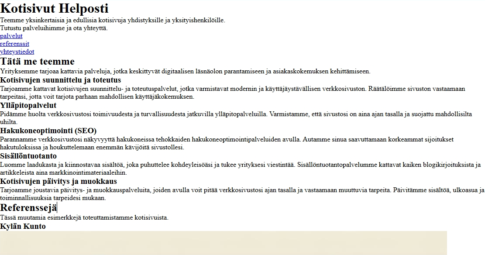</a>
   </div><br>

4. Seuraavaksi päästään määrittelemään sivun lopullista ulkoasua. Ulkoasun määrittely aloitetaan `body`-elementin asetuksilla, joilla määritellään koko dokumenttia koskevat asetukset. Kopioi seuraavat rivit edellisten alapuolelle.

   ```css
   body {
     font-family: "Inter", sans-serif;
     font-optical-sizing: auto;
     font-weight: 400;
     font-style: normal;
     background-color: var(--primary-dark);
     color: var(--neutral-lightest);
   }
   ```

   Fontin määritykset on kopioitu suoraan Google Fonts -palvelun esimerkkimäärityksistä. Ne määrittelevät käytettäväksi **Inter**-fonttia, sen normaalia paksuutta ja tyyliä. Tämän lisäksi määritellään koko dokumentille sen taustaväri (punainen) ja tekstiväri (valkoinen).

   Tausta- ja tekstivärin määrityksissä on esimerkki siitä, miten CSS-tiedoston alussa määriteltyjä muuttuja-arvoja käytetään. 

   <div class="image">
     <a href="onepagecss-2-full.png">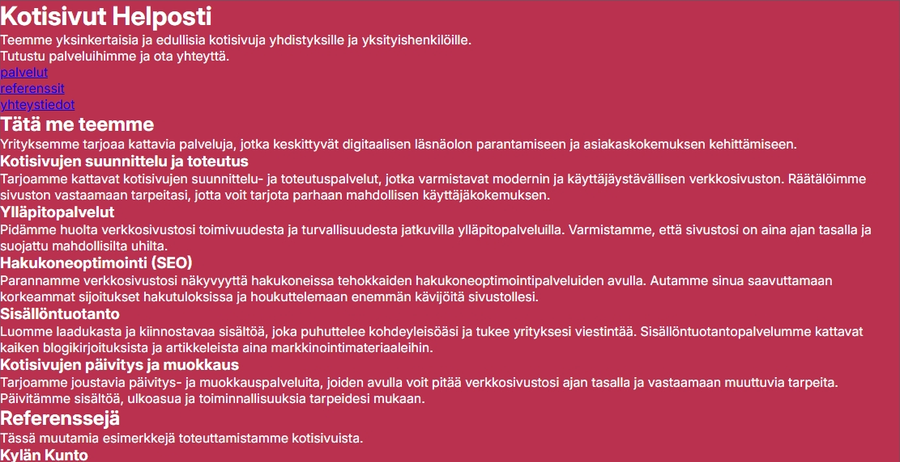</a>
   </div><br>

5. Tällä hetkellä sivun sisältö on yhtenä jatkuvana juoksutuksena, ilman selkeitä osakokonaisuuksia. Seuraavaksi määritellään sivusto näyttämään siltä, että se koostuisi useammasta päällekkäisestä sivusta. Kopioi seuraavat rivit edellisten alapuolelle.

   ```css
   header, section {
     min-height: 100vh;  
     display: flex;
     flex-direction: column;
     justify-content: center;
     align-items: center;
     padding: 1.5em;
   }
   ```

   Selektorissa on listattu kaksi elementtiä pilkulla eroteltuna. Tämän seurauksena tämä sääntö kohdistuu sekä `header`- että `section`-elementteihin. Kun useampaan elementtiin halutaan määritellä samat säännöt, ne voidaan listata selektorissa pilkulla eroteltuna.

   `min-height`-asetus määrittelee `header`- ja `section`-elementtien vähimmäiskorkeudeksi selainikkunan näkymäalueen korkeuden (`vh` = viewport height). Tämä määritys tekee sen, että jokainen "sivu" on vähintään näkymäalueen korkuinen. Jos yksittäisen "sivun" korkeus on suurempi, niin silloin korkeus mukautuu sen mukaisesti.

   `display`-, `flex-direction`-, `justify-content`- ja `align-items`-asetukset määrittelevät sisällön sijoittumaan pysty- ja vaakasuunnassa keskelle. Tämä CSS:n Flexbox-ominaisuuden avulla. Nämä neljä riviä ovat näppärä tapa keksittää sisältö jonkin elementin keskelle.

   `padding`-asetus määrittelee "sivujen" reunoille pienen täytteen. Tämä huolehtii siitä, että tekstit ja muu sisältö eivät mene aivan reunaan kiinni, vaan reunoille pieni väli antamaan pientä tilan tuntua. Tämä asetus näkyy käytännössä vasta, kun sivulla oleva teksti on niin pitkä, että sitä joudutaan rivittämään. 

   <div class="image">
     <a href="onepagecss-3-full.png">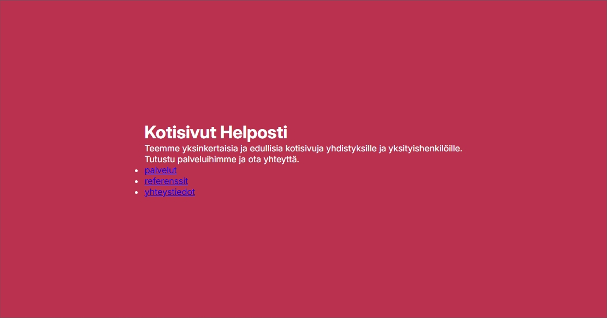</a>
   </div><br>

6. Seuraavaksi määritellään etusivun taustakuva. Tätä varten käy lataamassa ensin Unsplash-sivustolta [tässä linkissä](https://unsplash.com/photos/a-forest-of-trees-with-a-body-of-water-in-the-background-xHkmimemaOQ) oleva kuva klikkaamalla sivun oikeassa yläkulmassa olevaa **Download free** nappia ja tallenna se projektikansioon nimellä `03-background.jpg`.

   Unsplash on yksi ilmaisia kuvia tarjoavista kuvapalveluista. Sen hienoimmat kuvat kuuluvat usein sen maksulliseen palveluun, mutta ilmaislatauksessa on paljon käyttökelpoisia kuvia. Palvelun kuvia saa käyttää vapaasti myös kaupallisissa toteutuksissa ja niitä voidaan käyttää ilman mainintaa tekijästä.

   Kun olet hakenut edellä olevan kuvan ja vienyt sen projektikansioon pyydettyllä nimellä, niin kopioi seuraavat rivit CSS-tiedoston loppuun edellisten alapuolelle.

   ```css
   header {
     background-image: url("03-background.jpg");
     background-size: cover;
     background-position: top;
   }
   ```  

   <div class="image">
     <a href="onepagecss-4-full.png">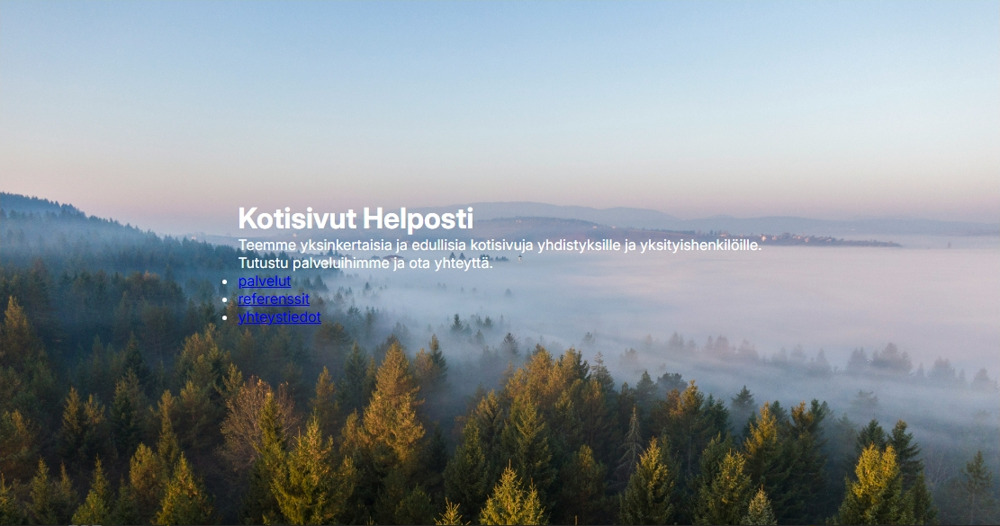</a>
   </div><br>

   Tämä asettaa etusivun taustakuvaksi edellä ladatun tiedoston. Taustakuva asetellaan niin, että se täyttää (`cover`) koko etusivun, jolloin sitä tarvittaessa suurennetaan tai pienennetään. Taustakuva asetetaan alkamaan ruudun yläreunasta, muilta sivuilta sisältöä tarvittaessa leikataan.

7. Etusivun tekstiä on vaikea lukea, koska valkoinen teksti ei ole helppo lukea vaaleaa taustaa vasten. Määritellään seuraavaksi teksti paremmin luettavaksi sijoittamalla se tummemmalle alustalle. Kopio seuraavat rivit edellistan alapuolelle.

   ```css
   header > div {
     font-size: 110%;
     background-color: var(--neutral-darkest-alpha);
     border-radius: calc(var(--border-radius) * 2);
     padding: 2em;
     text-align: center;
     display: flex;
     flex-direction: column;
     justify-content: center;
     align-items: center;
   }
   ```

   Tämä asetus kohdistuu välittömästi `header`-elementin alla olevaan `div`-elementtiin.

   > Huomaa, että asetus ei kohdistu `div`-elementilla alla oleviin `div`-elementteihin, vaan ainoastaan siihen `div`-elementtiin, joka on heti  `header`-elementin alla.
   >
   > `header div` -selektori kohdistuisi kaikkiin `header`-elementin alla oleviin `div`-elementteihin, olivat ne kuinka syvällä tahansa.

   Tämän `div`-elementin fonttikokoa suurennetaan hieman ja sen taustaväriksi asetetaan hieman läpikuultava musta. Tämän lisäksi laatikon reunoja pyöristetään hieman `border-radius`- asetuksella sekä laatikon sisälle määritellään hieman täytettä, jotta sisältö ei olisi reunoissa kiinni.

   `border-radius` -asetuksessa hyödynnetään CSS:n `calc`-laskentaominaisuutta. Siinä käytetään muuttujissa määriteltyä `--border-radius`-arvoa tuplaamalla sen arvo kaksinkertaiseksi. Tämä on yksinkertainen esimerkki siitä, miten arvoja voidaan laskea muista arvoista CSS-tyyleissä.

   Sisältö keskitetään laatikon sisälle samalla menetelmällä, mitä aiemmin käytettiin sivun sisältöjen keskittämiseen.

   <div class="image">
     <a href="onepagecss-5-full.png">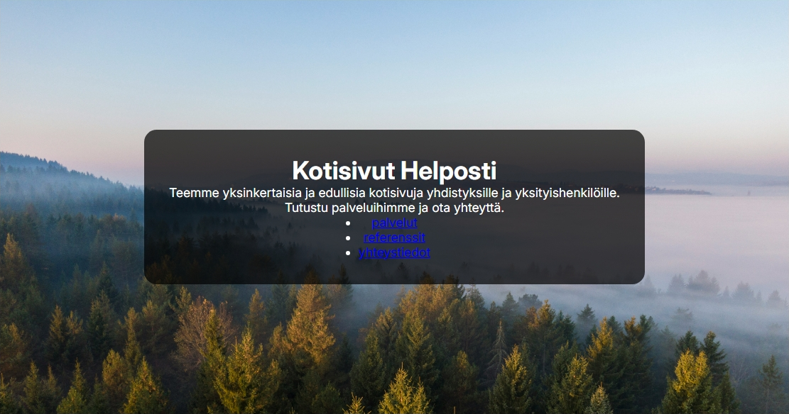</a>
   </div><br>

8. Muotoillaan seuraavaksi navigointia paremman näköiseksi. Kopioi seuraavat rivit edellisten alapuolelle.

   ```css
   nav ul {
     display: flex;
     align-items: center;
     justify-content: center;
     flex-wrap: wrap;
     margin-top: 1em;
   }
   ```

   Tämä sääntö kohdistuu kaikkiin `nav`-elementtien sisällä oleviin `ul`-listoihin. Sääntö sijoittaa navigointilinkit vaakaan sekä määrittelee linkkien yläpuolelle pienen marginaalin. `flex-wrap`-asetus huolehtii linkkien rivityksestä, kun sivun leveys tulee niin kapeaksi, että linkit eivät mahdu rinnakkain.

   <div class="image">
     <a href="onepagecss-6-full.png">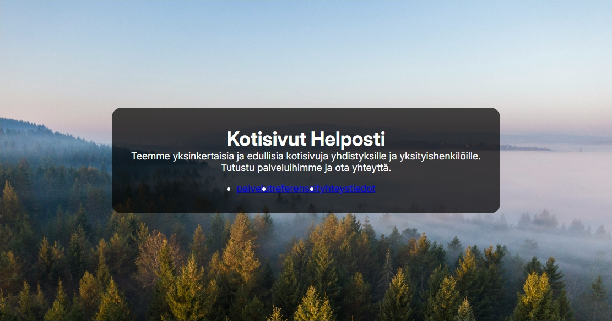</a>
   </div><br>

   Muotoillaan vielä yksittäiset lista-alkiot. Kopioi seuraavat rivit edellisten alapuolelle.

   ```css
   nav li {
     list-style-type: none;  
     background-color: var(--primary-dark);  
     padding: 1em;
     margin: 0.5em;
     border-radius: var(--border-radius);
   }
   ```

   Tämä sääntö kohdistuu `nav`-elemetin alla oleviin `li`-elementteihin. `list-style-type`-asetus poistaa lista-alkion edessä olevan pallukan. Loput määrittelevät lista-alkiolle taustavärin, täytteen, marginaalin ja kulman pyöreyden.

   <div class="image">
     <a href="onepagecss-7-full.png">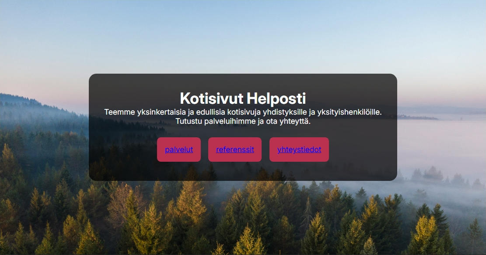</a>
   </div><br>

9. Aikaisemmin koko dokumentille asetettiin tekstiväri. Tämä asetus ei määrittele linkkien väriä, vaan ne tulee määritellä erikseen. Muokataan seuraavaksi navigointilinkkien värit toimivammiksi. Kopioi seuraavat rivit edellisten alapuolelle.

   ```css
   nav a {
     color: var(--neutral);
     text-decoration: none;
   } 
   ```

   Tämä sääntö kohdistuu `nav`-elementin alla oleviin linkkeihin. Linkin väriksi asetetaan neutraali sävy ja sen alleviivaus poistetaan.

   <div class="image">
     <a href="onepagecss-8-full.png">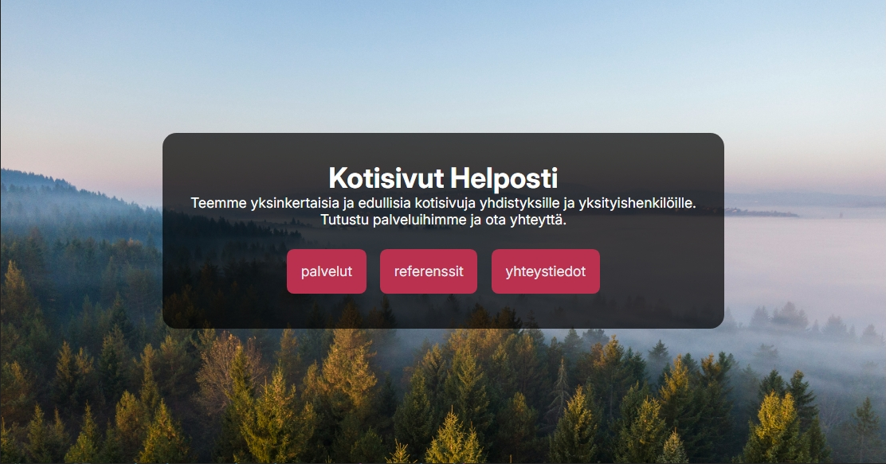</a>
   </div><br>

10. Määritellään navigointilinkeille  visuaalinen palaute, kun hiiren kursorin vie linkin päälle. Kopioi seuraavat rivit edellisten alapuolelle.

    ```css
    nav li:hover {
      background-color: var(--neutral);
    }

    nav li:hover a {
      color: var(--neutral-darkest);
    }
    ```

    Nämä säännöt kohdistuvat `nav`-elementin alla olevaan lista-alkioon ja linkkiin, kun hiiren kursori on lista-alkion päällä. Kun hiiren kursori on linkkilaatikon päällä, muuttuu laatikon taustavärin vaaleaksi ja tekstivärin tummaksi.

    Reagoiminen hiiren kursoriin tapahtuu `hover`-pseudoluokan avulla. Sen seurauksena säännössä olevat määritykset tulevat voimaan, kun hiiren kursori on elementin päällä. Kun hiiren kursori poistuu elementin päältä, palautuu alkuperäiset asetukset takaisin voimaan.

    Voit testata tämän toiminnallisuutta viemällä kursorin linkin päälle.

    <div class="image">
      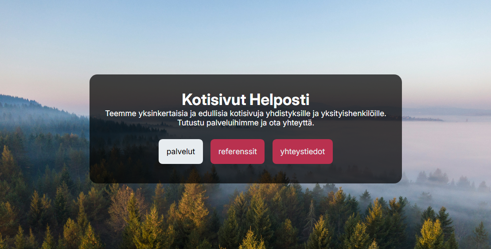
    </div><br>

    Etusivun määritykset ovat nyt valmiit, siirrätään määrittelemään muiden sivujen ulkoasua.

11. Muilla sivuilla on vielä koko dokumentille määritelty taustaväri (punainen). Muutetaan taustavärit seuraavksi neutraaleimmiksi. Kopioi seuraavat rivit edellisten alapuolelle.

    ```css
    section {
      background-color: var(--neutral);
      color: var(--neutral-darkest);
    }

    section:nth-child(odd) {
      background-color: var(--neutral-lightest);
    }
    ```

    Ensimmäinen sääntö määrittelee jokaisen `section`-elemementin taustaväriksi vaalean värisävyn ja tekstiväriksi tumman värisävyn.

    Toinen sääntö muuttaa joka toisen `section`-elementin taustaväriksi valkoisen. Tällä tavalla eri sivut saadaan eroteltua visuaalisesti toisistaan.

    <div class="image">
      <a href="onepagecss-10-full.png">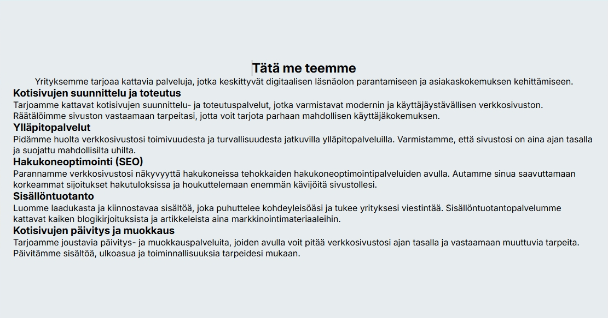</a>
    </div><br>

12. Sivun tekstiä on tällä hetkellä raskas lukea, koska tekstirivit ovat lähtökohtaisesti liian pitkiä. Säädetään seuraavaksi tekstirivin pituutta. Kopioi seuraavat rivit edellisten alapuolelle.

    ```css
    header p, section p {
      max-width: var(--max-width);
      margin: 0.5em 0;
    }
    ```

    Tämä määrittelee etusivun ja muiden sivun tekstikappale-elementtien maksimileveyden sekä niiden ylä- ja alapuolelle pienen välin.

    <div class="image">
      <a href="onepagecss-11-full.png">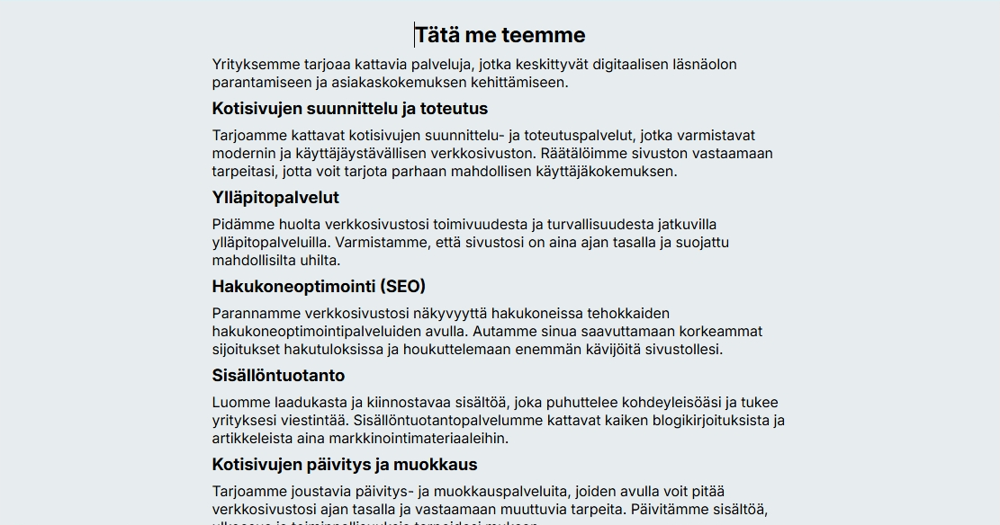</a>
    </div><br>

13. Sivuston otsikkoelementit kaipaavat seuraavaksi muokkaamista. Kopioi seuraavat rivit edellisten alapuolelle.

    ```css
    h1 {
      font-size: 300%;
      margin: 1em 0 0.5em 0;
    }

    h2 {
      font-size: 250%;
      margin: 1em 0;
    }
    ```

    Tämä asettaa `h1`- ja `h2`-elementtien tekstinkoon ja marginaalit. Tämä muutti etusivun pääotsikon lisäksi alasivun yläotsikot.

    <div class="image">
      <a href="onepagecss-12-full.png">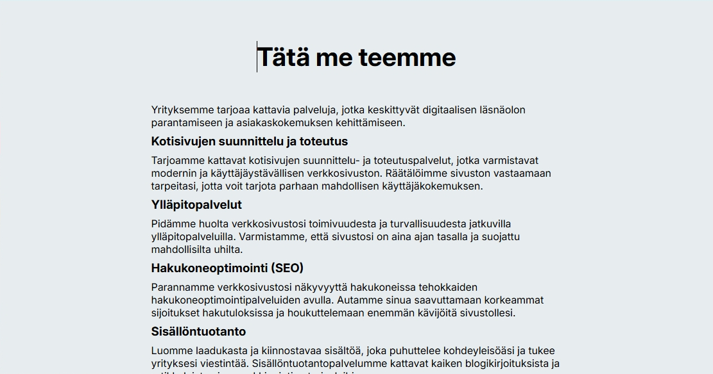</a>
    </div><br>

14. Seuraavaksi muokataan palvelut-osiossa olevat palvelut omiksi kokonaisuuksiksi. Kopioi ensin seuraavat rivit muiden jatkoksi.

    ```css
    .palvelut {
      display: flex;
      justify-content: center;
      flex-wrap: wrap;
      max-width: calc(var(--max-width) * 1.5);
      margin-top: 1em;
    }
    ```

    Tässä yhteydessä käytetään ensimmäisen kerran niin sanottua luokkaselektoria. Luokkaselektorilla sääntö voidaan kohdistaa niihin elementteihin, jotka on määritelty kuulumaan tiettyyn luokkaan `class`-määritteellä. CSS-tiedostossa selektorin alussa on `.`-merkki ja välittömästi sen perässä luokan nimi. Jos esimerkiksi elementille on määriltelty luokan nimeksi `yhteystiedot`, niin silloin siihen viitataan selektorilla `.yhteystiedot`.

    Tämä sääntö määrittelee `palvelut`-nimiselle elementtiluokan hyödyntämään Flexbox-asettelua. Aikaisemmista poiketen määritellään sisältö keskittymään vaakasuunnassa ja tarvittaessa rivittymään.

    Tämän lisäksi elementi maksimileveydeksi määritellään puolitoista kertaa tekstikappaleen maksimileveys. Koska palvelut tullaan asemoimaan useampi rinnakkain, niin silloin alueen maksimileveys voi olla leveämpi luettavuuden siitä kärsimättä.

    Tällä säännöllä ei ole isoa vaikutusta sivunäkymään. Jatketaan palveluiden ulkoasun määrittelyä. Kopioi seuraavat rivit edellisten alapuolelle.

    ```css
    .palvelut > div {
      background-color: var(--primary-dark);
      color: var(--neutral-lightest);
      margin: 0.5em;
      padding: 1.5em;
      border-radius: var(--border-radius);
      max-width: calc(var(--max-width) * 0.375);
    }
    ```

    Tämä sääntö kohdistuu välittämästi `palvelut`-luokkaelementin alla oleviin `div`-elementteihin. Tämä asettaa niiden taustaväriksi tumman sävyn ja tekstiväriksi vaalean sävyn. Tämän lisäksi asetetaan yksittäisen laatikon marginaalit, täyte ja kulmien pyöreys. Marginaaleilla saadaan erotettua laatikot toisistaan, täytteellä laatikon sisälle hieman tyhjää reunoille. 

    Laatikon maksimileveydeksi asetetaan laskukaavalla laskettu arvo, joka on 37,5% tekstikappaleen maksimileveydestä. Tämä varmistaa, että täydessä sivunleveydessä laatikoita sijoittuu kolme rinnakkain.

    <div class="image">
      <a href="onepagecss-13-full.png">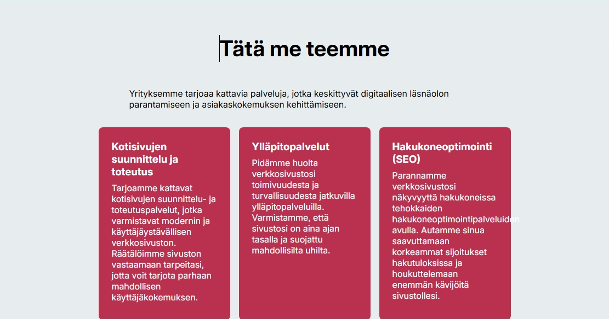</a>
    </div><br>    

    Asetetaan vielä yksittäisen laatikon otsikolle pienet marginaalit. Kopioi seuraavat rivit edellisten alapuolelle.

    ```css
    .palvelut h3 {
      margin: 0.8em 0;
    }
    ```

    Samalla korjataan HTML-tiedostossa *Hakukoneoptimointi (SEO)* -laatikossa oleva **hakukoneoptimointipalveluiden**-sana lyhyemmäksi. Sivuston ulkoasua on hyvä tarkkailla pitkin kehitysprosessia ja testailla sitä useilla eri selainikkunan leveyksillä.

    <div class="image">
      <a href="onepagecss-14-full.png">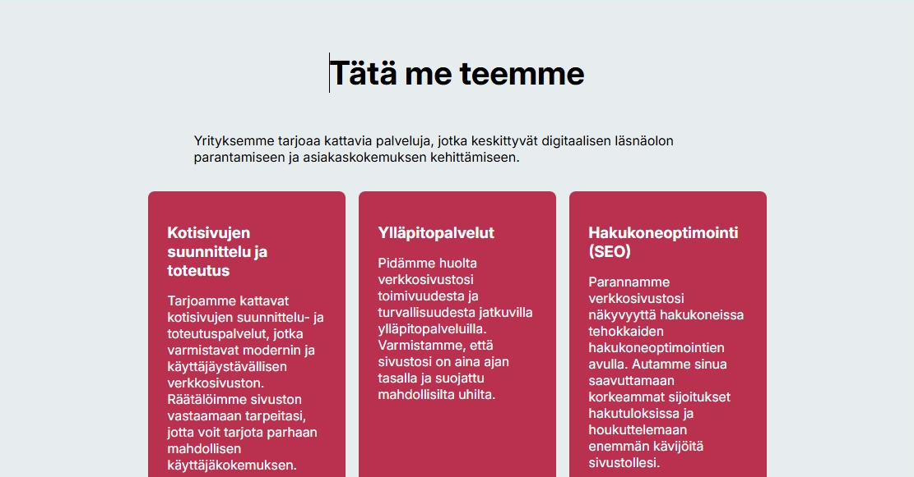</a>
    </div><br>

    Palvelut-osion ulkoasu on nyt määritelty. Siirrytään muokkaamaan seuraavaa osiota.

15. Referenssit osion esimerkkien ulkoasu määritellään hyvin samalla tavalla kuin Palvelut-osion ulkoasu. Aloita kopioimalla seuraavan rivit edellisten jatkoksi.

    ```css
    .referenssit {
      display: flex;
      justify-content: center;
      flex-wrap: wrap;
    }
    ```

    Tässäkin hyödynnetään luokkaselektoria, joka kohdistaa säännön `referenssit`-elementilleluokalle. Samalla tavalla kuin Palvelut-osiossa, myös tässä referenssit sijoitetaan keskelle vaakaan ja rivitetään tarvittaessa.

    Tämä asetus ei vielä muuttanut osion ulkoasua. Määritellään seuraavaksi yhden laatikon ulkoasu. Kopioi seuraavat rivit edellisten jatkoksi.

    ```css
    .referenssit > div {
      background-color: var(--primary-light);
      border-radius: var(--border-radius);
      margin: 1em;
      padding: 1.5em;
      max-width: calc(var(--max-width) * 0.5);
    }
    ```

    Tämä sääntö kohdistuu välittömästi `referenssit`-luokan alla oleviin `div`-elementteihin. Sille määritellään taustaväri, kulman pyöreys, marginaalit ja täyte. Näiden lisäksi yhden laatikon maksimileveydeksi asetetaan puolet tekstikappaleen maksimileveydestä.

    <div class="image">
      <a href="onepagecss-15-full.png">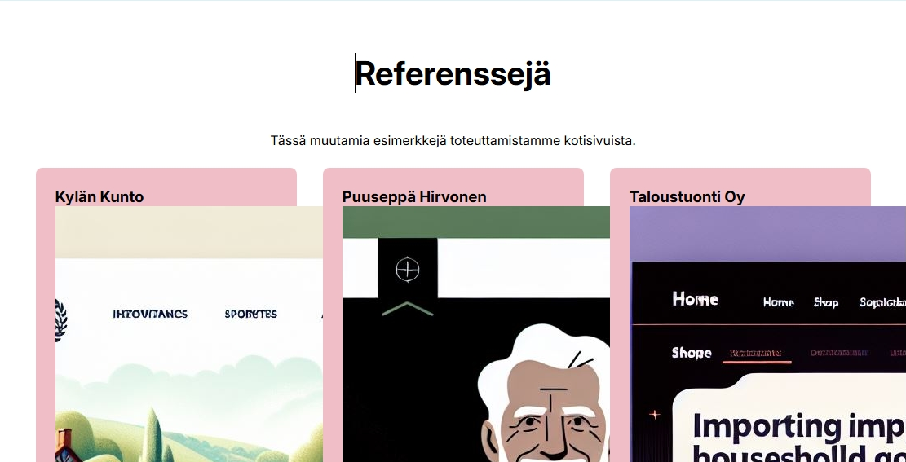</a>
    </div><br>

    Referenssikuvat pakottavat sivun leveämmäksi kuin mitä toivotaan, se korjataan seuraavaksi määritelemällä referenssilaatikon sisällön ulkoasu. Kopioi seuraavat rivit edellisten alapuolelle.

    ```css
    .referenssit h3 {
      color: var(--neutral-darkest);
      font-size: 150%;
      margin-bottom: 0.5em;
    }

    .referenssit p {
      margin: 1em 0;
    }

    .referenssit img {
      width: 100%;
    }
    ```

    Nämä asettavat referenssilaatikon elementeille seuraavat asiat.

      - `h3`-otsikolle värin, fonttikoon ja alamarginaalin.
      - `p`-tekstikappaleelle ylä- ja alamarginaalin.
      - `img`-kuvan käyttämään 100% sille annetusta tilasta. Tämä skaalaa kuvan oikeaan kokoon.

    <div class="image">
      <a href="onepagecss-16-full.png">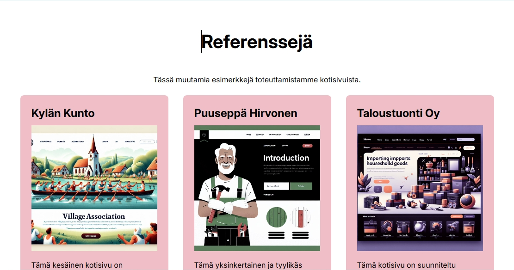</a>
    </div><br>   

16. Referenssit-osion ulkoasu on nyt valmis, siirrytään muokkaamaan Yhteystiedot-osion ulkoasua. Tämän osion ulkoasu on aika pitkälle määritelty aikasempien asetusten pohjalta. Korjataan ainoastaan osoitteen kursivointi ja puhelinumeron tekstiväri. Kopioi seuraavat rivit edellisten alapuolelle.

   ```css
   address {
     font-style: normal;
     font-weight: 600;
     margin-top: 1em;
   }

   address a {
     text-decoration: none;
     color: var(--primary-dark)
   }
   ```

   Tämä asettaa osoitteen tekstityyliksi normaalin (eli poistaa kursivoinnin), tekstin paksuudeksi lihavoinnin ja pienen ylämarginaalin. Lisäksi linkistä poistetaan alleviivaus ja tekstiväriksi asetetaan tumman punainen.

   <div class="image">
     <a href="onepagecss-17-full.png">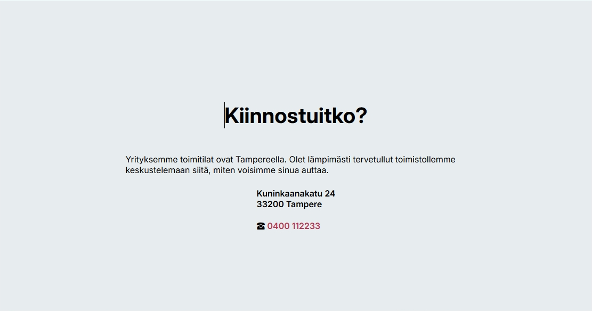</a>
   </div><br>    

17. Viimeisenä vaiheena on alaotsakkeen eli `footer`-elementin ulkoasun määrittely. Kopioi seuraavat rivit edellisten alapuolelle.

    ```css
    footer {
      font-size: 80%;
      padding: 2em;
      text-align: center; 
    }

    footer p {
      margin: 0.5em;
    }
    ```

    Nämä asetukset määrittelevät alaotsakkeen fonttikoon, täytteen ja keskittää tekstin keskelle. Tämän lisäksi alaotsakkeessa oleville tekstikappaleille määritellään pieni marginaali.

    <div class="image">
     <a href="onepagecss-18-full.png">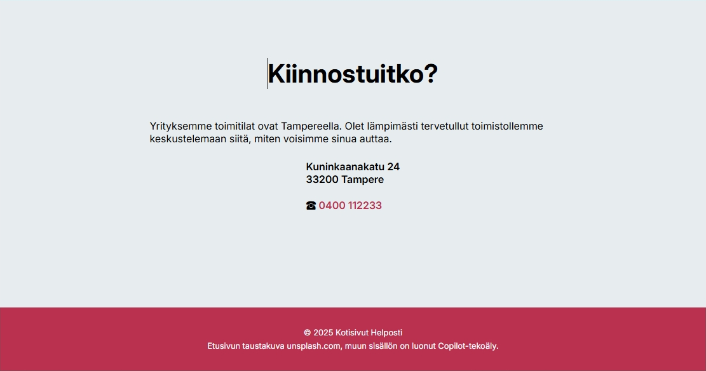</a>
   </div><br>

Nyt sivuston ulkoasu on kokonaisuudessaan valmis ja se näyttää seuraavanlaiselta:

<div class="image">
  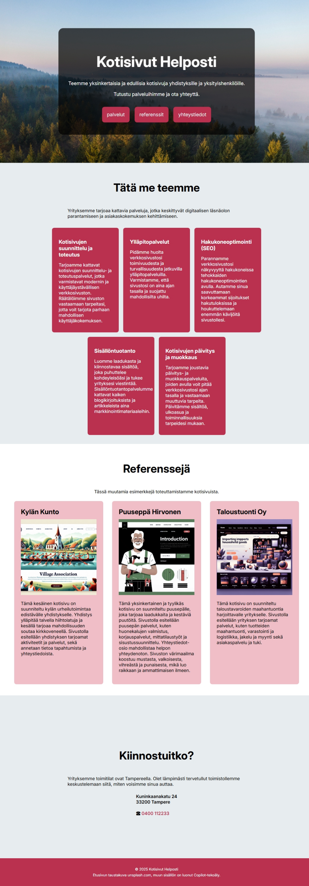
</div><br>