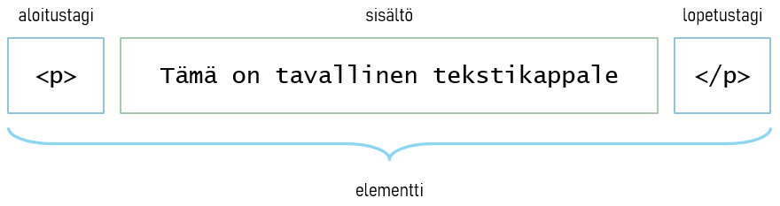

# HTML-kielen termistöä
 
## Elementit
 
HTML-merkkauksessa keskeinen käsite on **elementti**. Elementiksi kutsutaan
kokonaisuutta, jossa on *aloitustagi*, *sisältö* ja *lopetustagi*. Aloitustagi aloittaa kokonaisuuden ja lopetustagi puolestaan päättää sen. Kaikki mitä jää aloitus- ja lopetustagin väliin kutsutaan (elementin) sisällöksi.
 
Aloitustagin tunnistaa siitä, että se on sana tai lyhenne, joka on sijoitettu `<>`-merkkien sisälle. Esimerkiksi `<p>` on yksi yleinen aloitustagi. Lopetustagin tunnistaa siitä, että se on samanlainen kuin aloitustagi, mutta sanan tai lyhenteen edessä on `/`-merkki. Edellä olevan aloitustagin lopetustagi on `</p>`.
 
<div class="image">
 
</div>
 
## Sisäkkäiset elementit
 
Elementtejä voidaan laittaa myös sisäkkäin. Seuraavassa esimerkkikoodissa `p`-elementti on sijoitettu `div`-elementin sisälle. Huomaa, että elementit päätetään aina sisemmästä elementistä lähtien. Toisin sanoen alla olevassa esimerkissä `</p>`-lopetustagi tulee olla ennen `</div>`-lopetustagia.
 
```html
<div>
  <p>Tämä on tekstikappale.</p>
</div>
```
 
Todellisuudessa HTML-dokumentti muodostuu sisäkkäisistä elementeistä. Alla on typistetty HTML-dokumentin rakenne, josta näkee miten HTML-dokumentti päätasolla rakentuu.
 
```html
<html>
  <head>
    <title>Sivun otsikko</title>
  </head>
  <body>
    <p>Tämä on tekstikappale.</p>
  </body>
</html>
```
 
HTML-dokumentti koostuu kahdesta päätason elementistä: **head** ja **body**. `head`-elementti sisältää HTML-sivua kuvaavia tietoja, jotka eivät suoraan näy selainsivulla. Tällainen tieto on esimerkiksi selaimen välilehdellä näkyvä sivun otsikko. `body`-elementti sisältää HTML-sivun näkyvän sisällön.
 
Huomaa, että HTML-dokumentti voi sisältää ainoastaan yhden `html`, `head` ja `body`-elementin.
 
> Tämän materiaalin HTML-esimerkeissä on käytetty sisennyksiä, jotta merkkaus olisi luettavampaa. Nämä sisennykset eivät ole pakollisia HTML-merkkauksen toiminnan kannalta, sivu toimii samalla tavalla ilman niitäkin.
>
> Esimerkiksi seuraavat kaksi merkkaustapaa ovat toiminnaltaan täysin identtiset.
> ```html
> <div>
>   <p>Tämä on tekstikappale.</p>
> </div>
> ```
> ```html
> <div><p>Tämä on tekstikappale.</p></div>
> ```
>
> Näistä tavoista ensimmäinen on luettavampi ja helpommin muokattava. Tästä syystä on suositeltavaa opetella HTML-merkkauksen looginen sisentäminen heti alusta alkaen.
 
## Määritteet
 
HTML-elementtiä voidaan tarkentaa **määritteillä** (attribuuteilla). Ne sijoitetaan aina elementin aloitustagiin. Määrite muodostuu nimi- ja arvoparista. Määritteen nimi ja arvo erotetaan toisistaan `=`-merkillä.  
 
Alla olevassa esimerkissä `a`-elementille on määritetty `href`-määrite. Siinä `href` on määritteen nimi ja `"https://www.yle.fi"` on sen arvo. Yleissääntö on, että arvo on aina lainausmerkkien sisällä.
 
```html
<a href="https://www.yle.fi">Ylen kotisivut</a>
```
 
> Malttamattomille tiedoksi, `a`-elementti (anchor) muodostaa hyperlinkin sivulle. Linkkiä klikkaamalla avautuu `href`-määritteessä oleva URL-osoite.
 
Tulevissa esimerkeissä huomaat, että elementit voivat sisältää useampia tarkentavia määritteitä.
 
## Tyhjä elementti
 
HTML-elementti voi olla myös niin sanottu **tyhjä elementti**. Tyhjässä elementissä sisältö ja lopetustagi puuttuvat eli sillä on vain aloitustagi. Alla on esimerkki tyhjästä elementistä, jolla on vain aloitustagi. Aloitustagissa on määritelty elementille kaksi määritettä: `src` ja `alt`.
 
```html

```
 
`img` (image) on tyhjä elementti, jolla sivulle sijoitetaan kuva. Sijoitettavan kuvan osoite määritellään `src`-määritteellä ja kuvan vaihtoehtoinen kuvateksti määritellään `alt`-määritteellä. Tässä tapauksessa elementillä ei ole tarvetta sisällölle, joten sillä ei ole sisältöosaa eikä lopetustagia.
 
> Huomaa, että elementillä voi olla monia määritteitä, joista osa on pakollisia ja osa vapaaehtoisia. Esimerkiksi `src` ja `alt` ovat kummatkin `img`-elementin pakollisia määritteitä.
 
## Merkkauksessa sisältö on keskiössä
 
HTML-elementeillä merkataan dokumentin merkityksellistä sisältöä (semantiikkaa), ei sen ulkoasua. Tilanteessa käytettävä HTML-elementti valitaan sen merkityksen perusteella, ei sen ulkoasun perusteella.
 
Esimerkiksi seuraavassa merkkauksessa `h1`-elementillä kerrotaan tekstin olevan ensimmäisen tason otsikko eli sivun pääotsikko. Jos tätä elementtiä käytettäisiin ulkoasullisessa merkityksessä eli kun teksti halutaan näyttämään todella isona, niin silloin esimerkiksi ääneen lukevat selaimet korostavat tekstin väärällä tavalla.
 
```html
<h1>Tämä on sivun pääotsikko</h1>
```