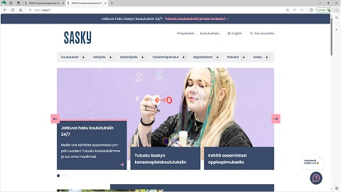
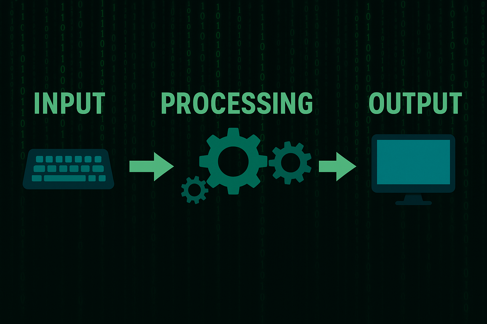

# JavaScript

Verkossa on runsaasti lähdemateriaalia tarjolla. Hyvä vaihtoehto on esimerkiksi sivusto [W3Schools Javascript](https://www.w3schools.com/js/default.asp) ja vaihtoehtoisesti vaikka maksutta saatavilla olevaa kirja [JavaScript From Zero to Hero](https://codersguild.net/download/2811_JavaScript-From-Zero-to-Hero.pdf) (hieman nurinkurisesti vasta luku 4 käsittelee alkeita, hyppää siis neljänteen lukuun). Linkki on toisinaan hyvin hidas, ole siis kärsivällinen.

Erinomainen tietolähde on myös ohjelmistokehittäjien yhteisö [Stack Overflow](https://stackoverflow.com/questions), jossa hakutoiminnon avulla voi etsiä vastauksia kysymyksiin ja jos kyseisestä asiasta ei löydy tietoja, voi lisätä oman kysymyksen. Vastaava ja kenties vielä suositumpi on [Stack Exchange](https://superuser.com/), johon kannattaa myös tutustua.

## Tämän materiaalin tavoite

Tämä itseopiskelumateriaali tarjaa vain välttämättömimmän sisällön ohjelmoinnin perusteisiin, jotta opiskelija pääsee omatoimisesti alkuun. Jos et ole aiemmin koodannut, sinun pitää alkuvaiheessa sietää sitä epävarmuuden tunnetta, että et vielä tiedä tarpeeksi. Jostain pitää aloittaa ja lähteä hitaasti etenemään ja tämän materiaalin puitteissa sivuutamme paljon erilaisia hienouksia tai oikopolkuja ja keskitymme pedagogisesti selkimpiin koodiratkaisuihin. Vähä vähältä uutta tietoa ja uusia taitoja alkaa kertyä. 

Älä huoli, vaikka JavaScript tuntuisi aluksi vaikealta – kaikki osaajat ovat joskus olleet samassa tilanteessa. Jokainen pieni askel vie sinua eteenpäin, ja pian huomaat ymmärtäväsi yhä enemmän. Ole utelias, kokeile rohkeasti ja muista: virheet ovat paras tapa oppia. Tämä on alku matkallesi luomaan omia verkkosovelluksia – ja se on aika siisti juttu!

Jos haluat käyttää tekoälyä hyväksesi, käytä sitä kuin se olisi opettaja: tee tekoälylle kysymyksiä, jotka alkavat sanalla "miksi":
- miksi tästä rivistä tulee syntax error
- miksi lauseeni ei tulosta mitään
- miksi saan virheilmoituksen 'unexpected token else'

Tällöin oma osaaminen karttuu nopeasti. Huonoin vaihtoehto on (ja tällä kurssilla se ei ole sallittu!) pyytää tekoälyä ratkaisemaan tehtäviä sinun puolestasi. Tällöin omaa oppimista ei tapahdu lainkaan.

## Ohjelmoinnin peruskäsitteet

Ohjelmointi on tapa antaa tietokoneelle tarkkoja ohjeita siitä, mitä sen tulee tehdä. Ohjelmat koostuvat yksittäisistä käskyistä, jotka suoritetaan yksi kerrallaan ennalta määrätyssä järjestyksessä. Näiden käskyjen avulla tietokone voi käsitellä tietoa, ratkaista ongelmia, suorittaa toistuvia tehtäviä ja reagoida käyttäjän toimintaan. Ohjelmointi on eräänlaista viestintää ihmisen ja koneen välillä, mutta kone ymmärtää vain tarkasti määriteltyä kieltä – ohjelmointikieltä. Tämän vuoksi ohjelmointi vaatii loogista ajattelua ja huolellista ohjeiden laatimista.

Useimpien ohjelmien perusrakenne noudattaa samaa yksinkertaista periaatetta: tietoja otetaan vastaan, niitä käsitellään, ja lopuksi tulokset näytetään käyttäjälle tai tallennetaan jonnekin. Näitä kolmea osaa kutsutaan nimillä syöte, prosessointi ja tuloste. Tämä kolmijako auttaa hahmottamaan ohjelman kulun ja sen, miten eri osat liittyvät toisiinsa.

### Syöte eli input
Syöte tarkoittaa tietoa, jota ohjelma saa ulkopuolelta. Tämä tieto voi tulla esimerkiksi käyttäjältä, joka kirjoittaa jotain näytölle ilmestyvään tekstikenttään, tai se voi olla tiedostossa oleva tieto, jonka ohjelma lukee automaattisesti. Ilman syötettä ohjelma toimisi aina samalla tavalla eikä voisi reagoida tilanteisiin tai käyttäjän tarpeisiin.

### Käsittely eli prosessointi
Kun tiedot on saatu syötteenä, ohjelma siirtyy seuraavaan vaiheeseen: käsittelyyn eli prosessointiin. Tässä vaiheessa ohjelma tekee varsinaisen työnsä. Se voi laskea, vertailla, muuntaa tai muuten käsitellä syötetietoja logiikan mukaisesti. Prosessointi on ohjelman ydin – siinä tapahtuu se, mitä varten ohjelma on kirjoitettu. Esimerkiksi laskinohjelmassa tämä vaihe tarkoittaa laskutoimituksen suorittamista käyttäjän syöttämien lukujen perusteella.

### Tulostus eli output
Kun tiedot on käsitelty, ohjelma siirtyy viimeiseen vaiheeseen eli tulostukseen. Tällöin ohjelma antaa käyttäjälle jotain näkyvää palautetta – esimerkiksi näyttää laskutoimituksen tuloksen, piirtää kuvaajan tai tallentaa tuloksen tiedostoon. Tuloste on ohjelman tapa kertoa, mitä tapahtui. Se voi olla yhtä yksinkertainen kuin teksti "Valmis!" ruudulla, tai monimutkaisempi esitys tuloksista, esimerkiksi tilasto tai raportti.

Yhteenvetona voi sanoa, että ohjelma on joukko ohjeita, joiden avulla tietokone osaa ottaa vastaan tietoa, käsitellä sen halutulla tavalla ja näyttää tai tallentaa tulokset. Tämä kolmiosainen rakenne – syöte, prosessointi ja tuloste – on läsnä melkein jokaisessa ohjelmassa, yksinkertaisimmista laskimista monimutkaisiin verkkosovelluksiin. **Ohjelmointi on siis ennen kaikkea järjestelmällistä ongelmanratkaisua, jossa kone tekee työn, mutta ihminen määrittää säännöt**.

### Koodilause

Koodilause on ohjelmointikielessä yksi yksittäinen käsky tai toimenpide, jonka tietokone suorittaa. Jokainen koodilause kertoo tietokoneelle, mitä se tekee seuraavaksi – esimerkiksi luo muuttujan, laskee jotain, näyttää tietoa tai muuttaa tietoa. Lauseita suoritetaan yleensä ylhäältä alas, yksi kerrallaan, siinä järjestyksessä kuin ne on kirjoitettu.

Koodilause muistuttaa tavallisen kielen virkettä: siinä on aina jokin toiminto ja usein myös kohde, johon toiminto kohdistuu. Esimerkiksi lause "Anna Maijalle omena" kertoo, kuka saa mitä. Vastaavasti ohjelmointikielen lause voi sanoa: "laske yhteen nämä luvut ja tallenna tulos".

### Miten testaan nopeasti JavaScript-lauseen?

<!--
[](https://www.youtube.com/watch?v=K5MPBOznDSc)
-->

<a href="https://www.youtube.com/watch?v=K5MPBOznDSc" target=_blank></a>

Klikkaa yllä olevaa kuvaa nähdäksesi videon.


Muutamia esimerkkejä JavaScriptin koodilauseista:

```javascript
let nimi = "Anna"
```
Tämä lause luo muuttujan nimeltä ```nimi``` ja tallentaa siihen tekstin ```"Anna"```.

```javascript
let summa = 5 + 3
```
Tässä lasketaan yhteen luvut 5 ja 3, ja tulos (eli 8) tallennetaan muuttujaan ```summa```.

```javascript
console.log("Hei maailma!")
```
Tämä lause näyttää tekstin selaimen konsolissa. Konsoliin tulostaminen  on yleinen tapa tarkistaa, mitä ohjelma tekee.

```javascript
luku++
```
Tämä lause kasvattaa yhdellä kokonaisluvun sisältävää muuttujaa nimeltä ```luku```. Se on lyhyempi tapa kirjoittaa ```luku = luku + 1```.

Jokainen näistä esimerkeistä on yksi itsenäinen koodilause. Ohjelma koostuu useista tällaisista lauseista, jotka muodostavat yhdessä toimivan kokonaisuuden. Aivan aluksi tärkeää on oppia lukemaan ja kirjoittamaan näitä lauseita selkeästi ja loogisesti.

<br>




<br>
