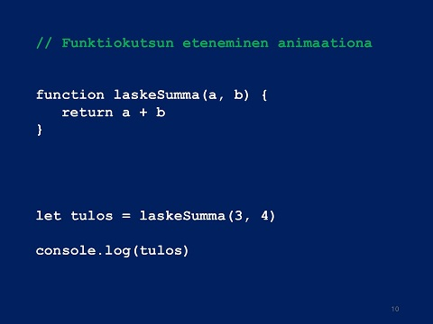

# Funktiot

## Mikä on funktio ohjelmoinnissa ja miksi niitä tarvitaan?

Funktio on ohjelmoinnissa kuin pieni ohjelma ohjelman sisällä. Se on nimetty kokonaisuus koodia, joka suorittaa tietyn tehtävän. Funktio voi ottaa syötteitä (eli parametreja), käsitellä ne, ja palauttaa tuloksen. Funktioita käytetään, jotta ohjelmakoodista tulee **selkeämpää**, **uudelleenkäytettävää**, ja **helpommin ylläpidettävää**.

Ilman funktioita joutuisi kirjoittamaan saman koodin moneen kertaan. Funktio mahdollistaa saman toiminnon suorittamisen monta kertaa eri tilanteissa vain yhdellä koodinpätkällä. Esimerkiksi jos haluat laskea kahden luvun summan useassa kohdassa ohjelmaa, voit tehdä sen yhden summalaskufunktion avulla – etkä toista samaa koodia moneen kertaan.

### Valmiit funktiot


Kaikissa ohjelmointikielissä on suuri joukko valmiita funktioita, jotka ovat kielen kehittäjien kirjoittamia. Niitä on JavaScriptissäkin useita satoja. Ne ovat ikään kuin reservissä odottamassa, että niitä kutsutaan.

Olet jo aiemmin käyttänyt esimerkiksi ```alert()``` ja ```console.log()```-funktioita. Muita hyvin usein käytettyjä ovat esimerkiksi ```parseInt()```, ```Math.random()``` ja ```prompt()```.

Funktio karkeasti ottaen käyttäytyy kuin kielen komentosana ja niitä on helppo koodata itse lisää.

Joku on koodannut nämä funktiot valmiiksi ja nyt me voimme vain käyttää niitä suoraan, eikä meidän tarvitse edes tietää, mitä funktion sisällä tapahtuu. Riittää, että tiedämme esimerkiksi sen, että ```alert("moi")``` avaa pienen ikkunan ja tulostaa sen sisään parametrina antamamme viestin. Tämä on esimerkki uudelleenkäytettävyydestä.

### Miten funktio määritellään JavaScriptissä?

JavaScriptissä funktio voidaan määritellä usealla tavalla, mutta tavallisin perusmuoto on seuraava:

```javascript
function nimi(parametri1, parametri2) {
  // täällä suoritetaan toimintoja
  return tulos;
}
```
- ```function``` on varattu sana, joka kertoo että ollaan tekemässä funktiota.

- nimi on funktion nimi. Sen avulla funktiota voidaan kutsua myöhemmin.

- suluissa ```()``` määritellään parametrit eli syötteet, joita funktio ottaa vastaan.

- altosulkujen ```{}``` sisällä on funktion sisältö eli mitä se tekee. Tämä on lohko, johon tutustiomme jo aiemmin.

- ```return``` palauttaa arvon funktion kutsujalle. Jos return-lausetta ei ole, funktio palauttaa undefined.

**HUOMAA, kun olemme kirjoittaneet funktion valmiiksi, se jää ikään kuin reserviin odottamaan, että sitä kutsutaan jossain koodin myöhemmässä vaiheessa. Funktion mää'rittely ei siis vielä käynnistä sitä.**

## Esimerkit

### Esimerkki 1: yksinkertainen tervehdysfunktio
```javascript
function tervehdi() {
  console.log("Hei maailma!")
}
```

#### Selitys vaiheittain:

1. ```tervehdi()``` määrittelee funktion nimeltä tervehdi, joka ei ota mitään parametreja.

2. ```{ ... }``` sisältää funktion rungon.

3. ```console.log("Hei maailma!")``` tulostaa tekstin konsoliin.

4. Muistutus vielä uudelleen: funktiota ei suoriteta automaattisesti vaan sitä pitää kutsua erikseen. Kutsu on ikäänkuin uusi komentosana, joka voi esiintyä muualla koodissa omana lauseenaan. Kutsu voidaan myös kytkeä jonkin tapahtuman seuraukseksi, esimerkiksi käyttäjä klikkaa painiketta, joka kutsuu funktiota. Funktion kutsu tämän funktion tapauksessa on yksinkertaisesti rivi, jossa on funktion nimi ja sulut, jotka ovat pakolliset.

**Funktion kutsuminen:**
```javascript
tervehdi()
```


### Esimerkki 2: Funktio, joka laskee summan

```javascript
function laskeSumma(a, b) {
  return a + b
}
```
#### Selitys vaiheittain:

1. ```function laskeSumma(a, b)``` määrittelee funktion nimeltä laskeSumma, joka ottaa kaksi parametria: ```a``` ja ```b```.

2. ```return a + b``` laskee muuttujien summan ja palauttaa sen.

Funktiota kutsutaan näin:

```javascript
let tulos = laskeSumma(3, 4)    // tulos saa arvon 7
console.log(tulos)              // tulostaa: 7
```
#### Selitys:
Funktion kutsussa sulkujen sisällä on kaksi lukua; 3 ja 4.Kutsuttaessa ensimmäinen näistä parametreista, eli 3, asetetaan ensimmäisen funktion parametrimuuttujan ```a``` arvoksi. Toinen parametri 4 menee parametrimuuttujan ```b``` arvoksi. Tässä vaiheessa ohjelman suoritus "hyppää" funktioon, jossa siis a:n arvona 3 ja b:n arvona 4. 

Sen jälkeen funktio suorittaa laskutoimituksen ja **palauttaa** vastauksen. Samalla funktio päättyy ja ohjelman suoritus palaa takaisin sinne, missä funktiota kutsuttiin.  Kyseisellä rivillä on sijoituslause ```let tulos = laskeSumma(3, 4)``` jolloin funkiokutsun palautusarvo sijoitetaan muuttujan ```tulos``` arvoksi.

Lopuksi ohjelma tulostaa saamansa arvon näytölle.

Klikkaa alla olevaa kuvaa, niin näet yksinkertaisena animaationa kyseisen funktiokutsun etenemisen vaihe vaiheelta. Ohjelman suoritus "hyppää" välillä funktioon, jonka koodirivit suoritetaan, ja funktiosta palataan takaisin sinne, mistä sitä kutsuttiin.

<a href="https://youtu.be/YZe5mIHbzkE" target=_blank></a>


### Yhteenveto

Funktiot tekevät koodista loogisempaa jakamalla sen pienempiin osiin. JavaScriptissä funktion voi luoda helposti function-avainsanalla. Harjoittelemalla yksinkertaisilla esimerkeillä opit nopeasti, kuinka tehokas työkalu funktio on ohjelmoinnissa!

## Esimerkit

### Esimerkki 7

Kirjoita funktio, joka ottaa parametrina vastaan yhden luvun ja palauttaa sen neliön. Tulosta funktion palauttaman laskutoimituksen tulos napin painalluksesta.

Tässä esimerkissä on kaksi uutta asiaa, toinen on ```<input>```-elementin käyttö JavaScriptin kanssa ja toinen on ```onClick```-tapahtumaan liitetty funktiokutsu. Tutki esimerkkikoodia huolellisesti, kopioi se ja tallenna tiedostoksi ja kokeile toiminta selaimella. Samaa tekniikkaa käytetään myöhemminkin runsaasti.

Tässä vaiheessa ei tarvitse vielä selvittää ```document.getElementById("elementinTunniste")```-rakenteen toimintaa. Sen voi kopioida sellaisenaan tehtävästä toiseen, kunhan vaihtaa jokaisessa kohdassa halutun elementin tunnisteen eli id:n kyseiseen kutsuun.

```javascript
<!DOCTYPE html>
<html>
<head>
  <meta charset="UTF-8">
  <title>Esimerkki 7 – Neliön laskeminen</title>
</head>
<body>
  <h2>Laske neliö</h2>
  <input type="number" id="luku" placeholder="Syötä luku">
  <button onclick="laskeNelio()">Laske</button>
  <p id="tulos"></p>

  <script>
    function laskeNelio() {
      let luku = Number(document.getElementById("luku").value);
      let nelio = luku * luku;
      document.getElementById("tulos").innerText = "Neliö on: " + nelio;
    }
  </script>
</body>
</html>
```

### Esimerkki 8

Kirjoita funktio, joka saa parametrina henkilön nimen ja tulostaa tervehdyksen "Hei, [nimi]!"

```javascript
<!DOCTYPE html>
<html>
<head>
  <meta charset="UTF-8">
  <title>Esimerkki 8 – Tervehdys</title>
</head>
<body>
  <h2>Tervehdi käyttäjää</h2>
  <input type="text" id="nimi" placeholder="Kirjoita nimesi">
  <button onclick="tervehdi()">Tervehdi</button>
  <p id="tervehdys"></p>

  <script>
    function tervehdi() {
      let nimi = document.getElementById("nimi").value;
      document.getElementById("tervehdys").innerText = "Hei, " + nimi + "!";
    }
  </script>
</body>
</html>
```
### Esimerkki 9

Kirjoita funktio, joka kertoo onko syötetty luku parillinen vai ei.

```javascript
<!DOCTYPE html>
<html>
<head>
  <meta charset="UTF-8">
  <title>Esimerkki 9 – Parillisuus</title>
</head>
<body>
  <h2>Tarkista onko luku parillinen</h2>
  <input type="number" id="luku" placeholder="Syötä luku">
  <button onclick="tarkistaParillisuus()">Tarkista</button>
  <p id="vastaus"></p>

  <script>
    function tarkistaParillisuus() {
      let luku = Number(document.getElementById("luku").value);
      if (luku % 2 === 0) {
        document.getElementById("vastaus").innerText = "Luku on parillinen.";
      } else {
        document.getElementById("vastaus").innerText = "Luku on pariton.";
      }
    }
  </script>
</body>
</html>
```

## Harjoitukset

Nämäkin harjoitukset ovat vapaaehtoisia ja tarkoitettu koodaustaitojen opiskeluun.

### Harjoitus 17

Kirjoita HTML-sivu, jossa käyttäjältä kysytään kaksi lukua. Luo funktio, joka laskee lukujen summan ja näyttää sen sivulla.

### Harjoitus 18

Luo HTML-sivu ja funktio, joka tarkistaa annetun iän perusteella, kuuluuko käyttäjä seuraaviin ryhmiin:

- Alle 13 → "lapsi"
- 13–19 → "nuori"
- 20 tai yli → "aikuinen"

Näytä tulos sivulla.

### Harjoitus 19

Kirjoita HTML-sivu ja funktio, joka muuntaa annetun lämpötilan celsius-asteista fahrenheiteiksi. ```(Kaava: F = C * 1.8 + 32)```

Näytä tulos sivulla.


## Mallipohjat avuksi harjoituksiin

Mikäli harjoitusten koodaaminen tuntuu ylipääsemättömän vaikealta, voit käyttää apunasi alla olevia tyhjiä mallipohjia. Niistä puuttuu vain JavaScript-funktio.

### Mallipohja 17

```javascript
<!DOCTYPE html>
<html>
<head>
  <meta charset="UTF-8">
  <title>Harjoitus 17 – Laske summa</title>
</head>
<body>
  <h2>Laske kahden luvun summa</h2>
  <input type="number" id="luku1" placeholder="Ensimmäinen luku">
  <input type="number" id="luku2" placeholder="Toinen luku">
  <button onclick="laskeSumma()">Laske</button>
  <p id="tulos"></p>

  <script>
    function laskeSumma() {
      // Täydennä funktio tähän
    }
  </script>
</body>
</html>
```


### Mallipohja 18

```javascript
<!DOCTYPE html>
<html>
<head>
  <meta charset="UTF-8">
  <title>Harjoitus 18 – Ikäryhmä</title>
</head>
<body>
  <h2>Tarkista ikäryhmä</h2>
  <input type="number" id="ika" placeholder="Anna ikäsi">
  <button onclick="tarkistaIka()">Tarkista</button>
  <p id="vastaus"></p>

  <script>
    function tarkistaIka() {
      // Täydennä funktio tähän
    }
  </script>
</body>
</html>
```


### Mallipohja 19

```javascript
<!DOCTYPE html>
<html>
<head>
  <meta charset="UTF-8">
  <title>Harjoitus 19 – Celsius to Fahrenheit</title>
</head>
<body>
  <h2>Muunna lämpötila</h2>
  <input type="number" id="celsius" placeholder="Celsius-asteet">
  <button onclick="muunna()">Muunna</button>
  <p id="fahrenheit"></p>

  <script>
    function muunna() {
      // Täydennä funktio tähän
    }
  </script>
</body>
</html>
```

