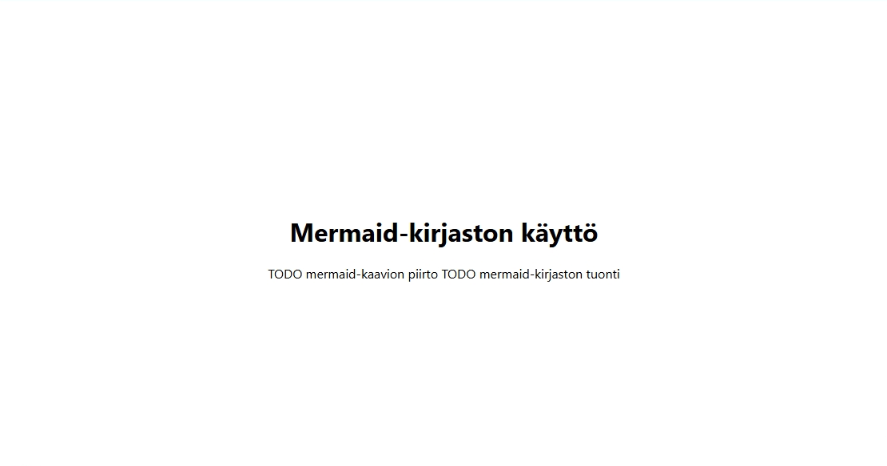
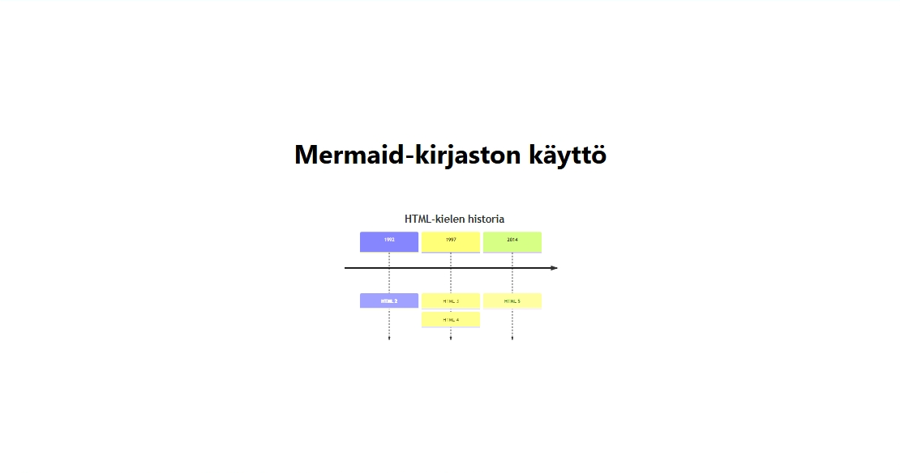
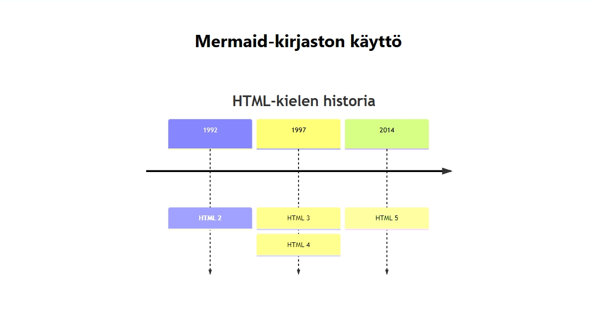

# Mermaid-kirjasto

[Mermaid](https://mermaid.js.org/)-kirjasto mahdollistaa erilaisten kaavioiden lisääminen helposti HTML-sivulle. Mermaidin tehokkuus on siinä, että kaavion rakenne esitetään tietynlaisena tekstiesityksenä, josta kirjasto muodostaa graafisen esityksen. Kirjastoa ylläpidetään GitHub-palvelussa, sen lähdekoodi löytyy [mermaid](https://github.com/mermaid-js/mermaid)-projektisivulta.

Seuraavaksi tutustutaan siihen, miten Mermaid-kirjasto lisätään osaksi HTML-sivua ja miten sillä piirretään kaavio.

## Sivupohja

Aloitetaan tämä luomalla ensin yksinkertainen sivupohja. Luo projektikansioon uusi tiedosto, anna sen nimeksi `04-mermaid.html` ja liitä sen sisällöksi seuraava HTML-koodi.

```html
<!DOCTYPE html>
<html lang="fi">
  <head>
    <meta charset="UTF-8">
    <title>Mermaid-kirjaston käyttö</title>
    <link href="04-mermaid.css" rel="stylesheet">
</head>
  <body>

    <h1>Mermaid-kirjaston käyttö</h1>

    TODO mermaid-kaavion piirto

    TODO mermaid-kirjaston tuonti

  </body>
</html>
```

Luo projektikansioon myös toinen uusi tiedosto, anna sen nimeksi `04-mermaid.css` ja liitä sen sisällöksi seuraava CSS-sääntö.

```css
body {
  font-family: system-ui, sans-serif;
  min-height: 100vh;
  display: flex;
  flex-direction: column;
  justify-content: center;
  align-items: center;
}
```

Sivupohjan HTML-koodi ja CSS-määritykset ovat tuttuja jo aikaisemmista osista. CSS-tyylit määrittelevät fontiksi käyttöjärjestelmässä käytössä olevan fontin ja sisältö keskitetään pysty- ja vaakasuunnassa keskelle.

<div class="image">
  
</div><br>

TODO-rivit sijoittuvat sivulle peräkkäin, koska niitä ei ole sijoitettu HTML-elementtien sisälle. HTML-kielessä perinteisellä rivinvaihdolla ei ole vaikutusta. 

## Mermaid-kirjaston tuonti

Aivan ensimmäiseksi Mermaid-kirjaston ohjelmakoodi täytyy tuoda osaksi omaa HTML-sivua. Tässä materiaalissa noudatetaan Mermaid-kirjaston [Getting Started](https://mermaid.js.org/intro/getting-started.html) -sivun ohjeita kohdassa **Calling the Mermaid JavaScript API**.

Korvaa HTML-tiedostossa `TODO mermaid-kirjaston tuonti` -rivi seuraavalla HTML-koodilla:

```html
    <script type="module">
      import mermaid from 'https://cdn.jsdelivr.net/npm/mermaid@11/dist/mermaid.esm.min.mjs';
      mermaid.initialize({ startOnLoad: true });
    </script>
```

Tämä tuo Mermaid-kirjaston CDN-palvelusta ja käynnistää sen sivun lataamisen yhteydessä. Sivun lopussa oleva TODO-tekstirivi poistui, muuten sivun sisältö pysyi vielä ennallaan.

## Kaavion piirtäminen

Mermaidissa kaavioiden piirtäminen tapahtuu kuvaamalla kaavion sisältö tietynlaisella tekstinä. Korvaa `TODO mermaid-kaavion piirto` -teksti seuraavalla HTML-koodilla:

```html
    <pre class="mermaid">
        timeline
          title HTML-kielen historia
          1992 : HTML 2
          1997 : HTML 3
               : HTML 4
          2014 : HTML 5
    </pre>
```

Tämä määritys luo yksinkertaisen aikajanan, josta ilmenee vuosiluvut, jolloin HTML-kielen eri versiot on julkaistu. Tämä näyttää selaimessa seuraavalta.

<div class="image">
  
</div><br>

Kaavio saattaa piirtyä oletusasetuksilla liian pienenä. Kaavion kokoa voi muuttaa muokkaamalla `.mermaid`-luokan CSS-asetuksia. Lisää seuraava CSS-sääntö CSS-tiedoston loppuun.

```css
.mermaid {
  width: 80vw;
  max-width: 50em; 
}
```

Tämä asettaa kaavion leveydeksi 80 % koko näyttöalueen leveydestä, mutta leveys voi olla maksimissaan 50 kirjaimen korkeutta. Tällä tavalla kaavio skaalautuu sivun mukana, mutta sen leveys ei ylitä sen maksimileveyttä.

Tämän lisäyksen jälkeen sivu näyttää seuraavalta.

<div class="image">
  
</div><br>

Samalla tavalla Mermaidilla voidaan piirtää muitakin kaaviotyyppejä, kuten esimerkiksi [sekvenssikaavioita](https://mermaid.js.org/syntax/sequenceDiagram.html), [tilakaavioita](https://mermaid.js.org/syntax/stateDiagram.html), [Gantt-kaavioita](https://mermaid.js.org/syntax/gantt.html), [piirakkakaavioita](https://mermaid.js.org/syntax/pie.html), [Gitgraph-kaavioita](https://mermaid.js.org/syntax/gitgraph.html) ja  [ajatuskarttoja](https://mermaid.js.org/syntax/mindmap.html).