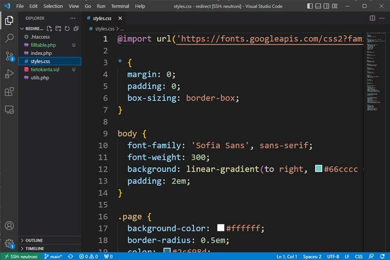

# Tarvittavat ohjelmat

Jotta voit tehdä kaikki tässä materiaalissa olevat esimerkit, tarvitset
  - graafisen selaimen ja 
  - tekstieditorin.

Tämän materiaalin esimerkkien testaamiseen ei vaadita tehokasta konetta, johon on asennettu kaikki viimeisimmät sovelluskehityksen työkalut. Minimissään käyttöjärjestelmäsi mukana tulleet ohjelmat riittävät. 

## Graafinen selain

Materiaalissa tehtyjen HTML-sivujen katseluun soveltuu mikä tahansa graafinen selain. Se selain, mitä käytät aktiivisesti, käy tähän aivan mainiosti. Materiaalissa olevat esimerkkikuvat ovat Microsoftin Edge -selaimesta, mutta lopputulos näyttää pääosin samalta myös muilla selaimilla.

## Tekstieditori

HTML-sivujen tekemisessä yksi tärkeimmistä työkaluista on tekstieditori. Sillä muokataan HTML-kooditiedostoja ja muita tiedostoja. Periaatteessa tähän tarkoitukseen kelpaa melkein mikä tahansa tekstieditori, hätätilanteessa Windowsin Muistio (Notepad) toimii editointiin. Jotta ohjelmakoodin kirjoittaminen olisi tehokasta ja tuottavaa, kannattaa ottaa käyttöön koodaamiseen erityisesti suunniteltu tekstieditori.

Tässä materiaalissa käytetään Microsoftin Visual Studio Code -tekstieditoria, pääosin seuraavista syistä:

 - Se on vapaan lähdekoodin projekti, toisin sanoen se on ilmainen.
 - Sille löytyy valmiit asennuspaketit Windowsille, Linuxille ja macOS:lle.
 - Se on kooltaan maltillinen ja se käynnistyy kohtuullisen nopeasti.

 

