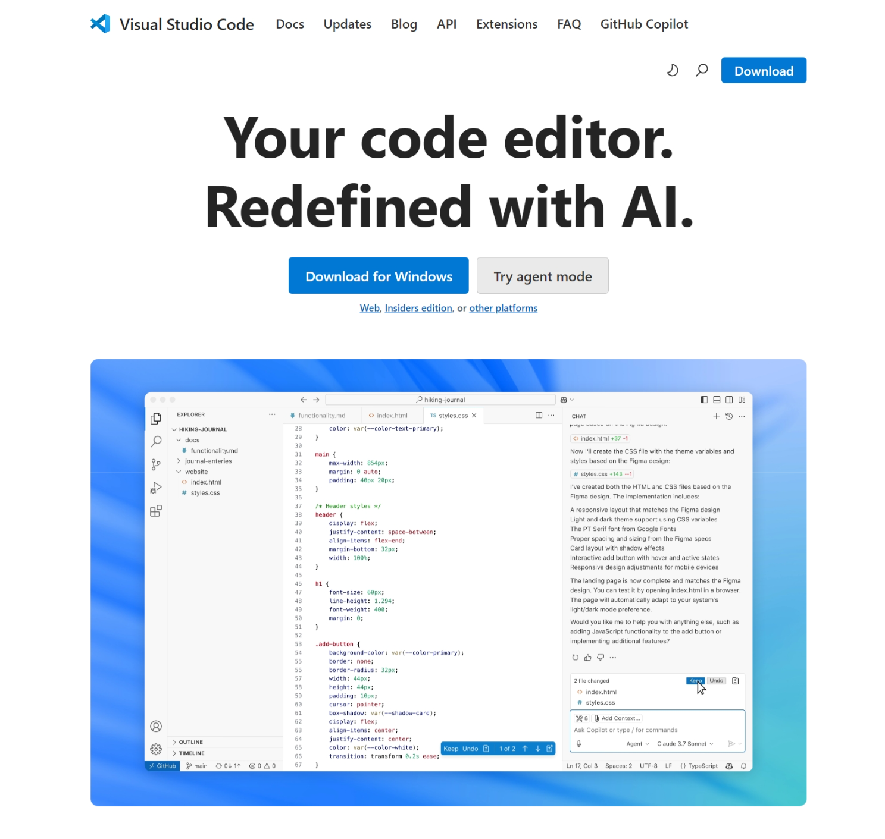
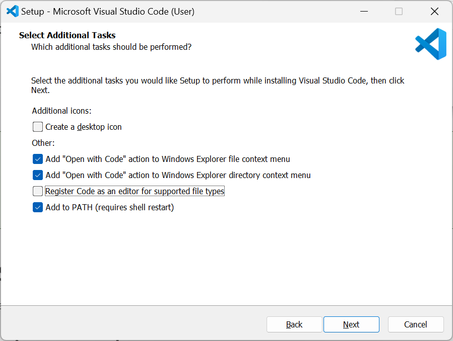
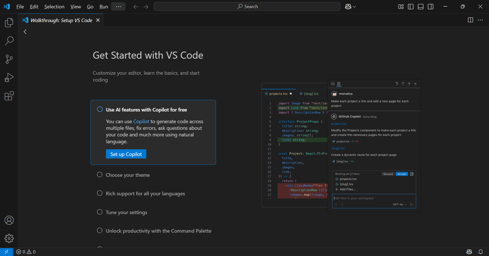

# Visual Studio Coden asentaminen
 
Tässä ohjeessa asennetaan Visual Studio Code -tekstieditori Windows-ympäristöön. Jos asennat editoria toiselle käyttöjärjestelmälle, niin mukaile asennuksen kulkua oman käyttöjärjestelmäsi mukaisesti.
 
1. Mene selaimella osoitteeseen [https://code.visualstudio.com](https://code.visualstudio.com).
 
   

     
   
 
   
 2. Klikkaa **Download for Windows**-nappia. Sivusto tunnistaa automaattisesti käyttämäsi käyttöjärjestelmän ja tarjoaa sitä vastaavaa asennuspakettia. Jos näin ei kuitenkaan tapahdu, niin klikkaa silloin sivun yläreunasta *Download*-nappia ja valitse sieltä käyttöjärjestelmääsi vastaava asennuspaketti.
   
 3. Käynnistä lataamasi asennuspaketti tuplaklikkaamalla sitä.
     - Valitse asennuksessa käytettävä kieli (English) ja paina **OK**-nappia.
     - Hyväksy *License Agreement* -näkymässä lisenssi valitsemalla **I accept the agreement** ja klikkaa **Next**.
     - Hyväksy *Select Destination Folder* -näkymässä oletuksena tarjottu asennuskansio klikkaamalla **Next**-nappia.
     - Samoin hyväksy *Select Start Menu Folder* -näkymässä tarjottu käynnistysvalikon kansionimi klikkaamalla **Next**.
     - Valitse *Select Additional Tasks*-näkymässä ne valinnat, jotka haluat ottaa käyttöön. Seuraavat valinnat ovat suositeltavia:

       - Add "Open with Code" action to Windows Explorer file context menu
       - Add "Open with Code" action to Windows Explorer directory context menu
       - Add to PATH (requires shell restart)
     
       

         
       
 
 
       Voit valita myös kohdan **Register Code as an editor for Supported file types**, jos et käytä aktiivisesti jotain toista tekstieditoria koodien ja muiden tekstitiedostojen muokkaamiseen. Hyväksy tekemäsi valinnat klikkaamalla **Next**.
     - Käynnistä *Ready to Install* -näkymässä asennus klikkaamalla **Install**.
     - Asennusohjelma asentaa kaikki tarvittavat tiedostot sekä määrittelee polkuasetuksen. Lopulta asennusohjelma päättyy *Completing the Visual Studio Code Setup Wizard* -näkymään, jossa voit klikata **Finish** päättääksesi asennusohjelman. 
     
       Asennusohjelma käynnistää oletuksena viimeisenä vaiheena juuri asennetun Visual Studio Coden.
 
       

         
       
 
 
       Voit tutustua Visual Studio Coden toimintaan *Get started with VS Code* -otsikon alta löytyvät opastuksen avulla.  

 Nyt Visual Studio Code on asennettuna ja valmiina käyttöön. Perehdymme sen käyttöön hieman myöhemmin, ennen sitä tutustumme  HTML-kielen perusteisiin. 